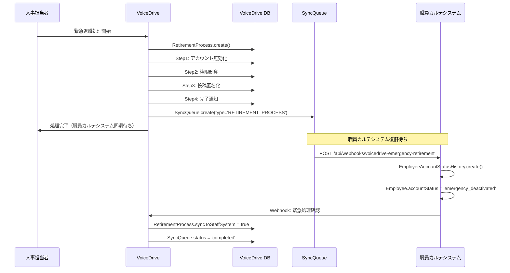
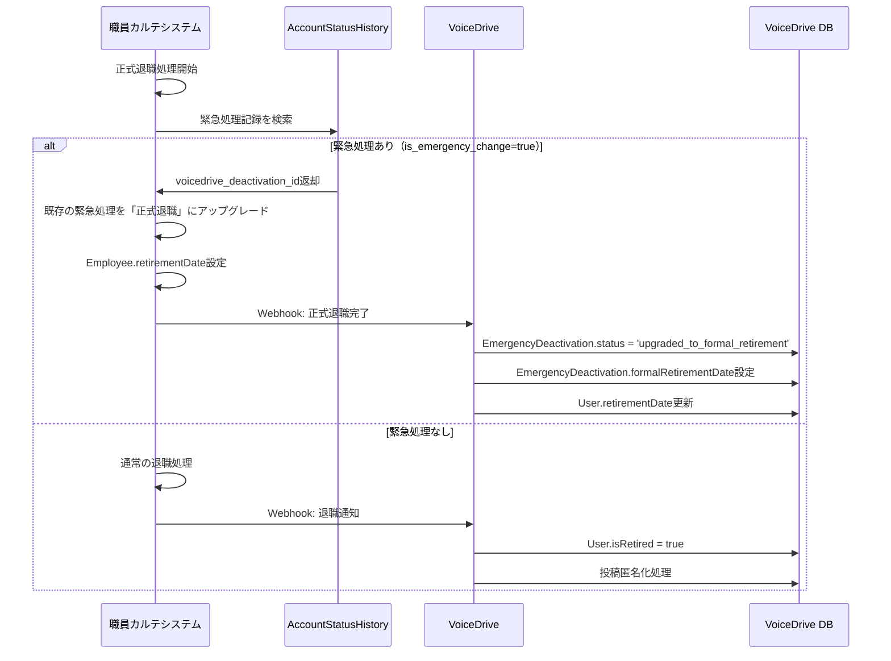
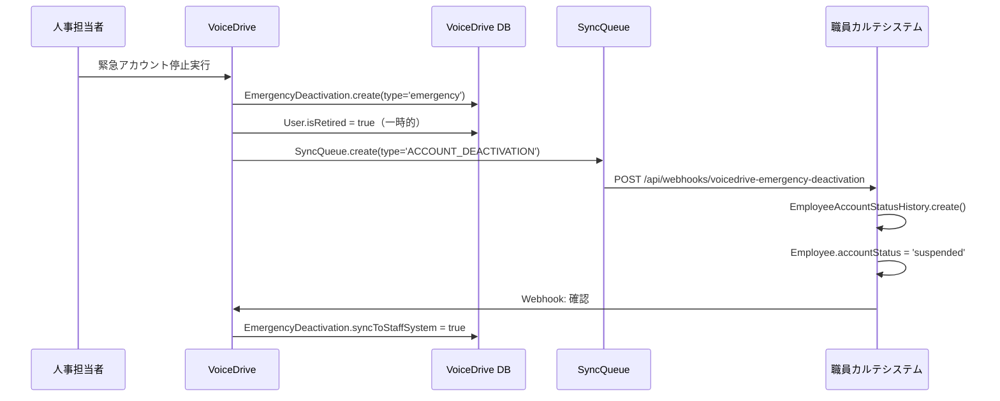

# 退職処理・緊急アカウント停止 - DB要件分析

**作成日**: 2025年10月18日
**対象機能**:
- 緊急退職処理ページ (`/retirement-processing`)
- 緊急アカウント停止ページ (`/emergency/account-deactivation`)
**目的**: データ管理責任分界点定義書に基づき、職員カルテシステムとの統合に必要なDB構造とAPI連携を明確化

---

## 📋 エグゼクティブサマリー

### 機能概要

VoiceDriveには2つの緊急処理機能があります：

| 機能 | URL | 目的 | 権限 |
|------|-----|------|------|
| **緊急退職処理** | `/retirement-processing` | 職員の退職に伴う4ステップ処理 | Level 14-17（人事部門） |
| **緊急アカウント停止** | `/emergency/account-deactivation` | 職員カルテシステム障害時の応急措置 | Level 14-17（人事部門） |

### 重要な背景

**マスタープランPhase 4より**:
- **通常フロー**: 職員カルテシステムで退職登録 → Webhookで自動処理
- **緊急フロー**: 職員カルテシステム障害時 → VoiceDriveで手動処理 → 復旧後に同期

### 現在の問題点（2025年10月18日時点）

🔴 **重大な問題**: 現在の実装は**LocalStorageベース**で、以下の課題があります：

1. **データ永続化なし**: ブラウザ依存、サーバー側で確認不可
2. **職員カルテシステムとの同期なし**: 二重処理のリスク
3. **監査要件を満たさない**: 法的要件を満たさない
4. **本番運用不可**: 緊急措置として機能しない

### データ管理責任

- **🔵 職員カルテシステムが責任**: 退職日、雇用ステータス、正式な退職処理
- **🟢 VoiceDriveが責任**: 緊急処理記録、同期キュー、VoiceDrive内のアカウント停止・匿名化
- **連携方式**: Webhook双方向連携 + 自動同期キュー

---

## 🗄️ データベース要件

### VoiceDrive側のテーブル（2025-10-18追加）

#### Table 1: EmergencyDeactivation（緊急アカウント停止記録）

**目的**: 職員カルテシステム障害時の応急措置を記録

**既存実装**: `prisma/schema.prisma` 1479-1512行目（2025-10-10作成、今回拡張）

**拡張内容**:

```prisma
model EmergencyDeactivation {
  id                    String    @id @default(cuid())

  // 対象職員情報
  targetUserId          String    @map("target_user_id")
  targetEmployeeId      String?   @map("target_employee_id")
  targetUserName        String?   @map("target_user_name")      // 🆕 追加

  // 実行者情報
  executedBy            String    @map("executed_by")
  executorEmployeeId    String?   @map("executor_employee_id")
  executorName          String?   @map("executor_name")
  executorLevel         Float     @map("executor_level")

  // 停止理由・詳細
  reason                String
  timestamp             DateTime  @default(now())
  isEmergency           Boolean   @default(true) @map("is_emergency")
  syncToStaffSystem     Boolean   @default(false) @map("sync_to_staff_system")
  syncedAt              DateTime? @map("synced_at")

  // ステータス（拡張）
  status                String    @default("pending")
  // 'pending' | 'completed' | 'synced' | 'failed' | 'upgraded_to_formal_retirement'

  deactivationType      String    @default("emergency") @map("deactivation_type") // 🆕 追加
  // 'emergency' | 'retirement'

  formalRetirementDate  DateTime? @map("formal_retirement_date")  // 🆕 追加（正式退職日）
  errorMessage          String?   @map("error_message")
  retryCount            Int       @default(0) @map("retry_count")  // 🆕 追加

  // 監査情報
  createdAt             DateTime  @default(now()) @map("created_at")
  updatedAt             DateTime  @updatedAt @map("updated_at")

  @@index([targetUserId])
  @@index([executedBy])
  @@index([timestamp])
  @@index([status])
  @@index([syncToStaffSystem])
  @@index([deactivationType])  // 🆕 追加
  @@map("emergency_deactivations")
}
```

**新規追加フィールド**:
- `targetUserName`: 対象職員名（キャッシュ）
- `deactivationType`: 緊急停止 or 退職処理の区別
- `formalRetirementDate`: 正式退職日（職員カルテシステムから通知）
- `retryCount`: リトライ回数

---

#### Table 2: RetirementProcess（退職処理記録）

**目的**: 緊急退職処理の4ステップフローを記録

**新規作成**: `prisma/schema.prisma` 2765-2812行目

```prisma
model RetirementProcess {
  id                    String    @id @default(cuid())

  // 対象職員情報
  targetUserId          String    @map("target_user_id")
  targetEmployeeId      String?   @map("target_employee_id")
  targetUserName        String?   @map("target_user_name")

  // 実行者情報
  initiatedBy           String    @map("initiated_by")            // User.id
  initiatorEmployeeId   String?   @map("initiator_employee_id")
  initiatorName         String?   @map("initiator_name")
  initiatorLevel        Float     @map("initiator_level")

  // 処理設定
  preserveAnonymousContent Boolean @default(true) @map("preserve_anonymous_content")
  anonymizationLevel    String    @default("department") @map("anonymization_level")
  // 'full' | 'department' | 'partial'
  retentionPeriod       Int       @default(24) @map("retention_period")  // 月単位

  // プロセス状態
  currentStep           Int       @default(1) @map("current_step")  // 1-4
  status                String    @default("in_progress") @map("status")
  // 'in_progress' | 'completed' | 'failed' | 'cancelled'

  // ステップ完了状況
  step1CompletedAt      DateTime? @map("step1_completed_at")  // アカウント無効化
  step2CompletedAt      DateTime? @map("step2_completed_at")  // 権限剥奪
  step3CompletedAt      DateTime? @map("step3_completed_at")  // 投稿匿名化
  step4CompletedAt      DateTime? @map("step4_completed_at")  // 完了通知

  // 同期情報
  syncToStaffSystem     Boolean   @default(false) @map("sync_to_staff_system")
  syncedAt              DateTime? @map("synced_at")

  // 処理結果
  completedAt           DateTime? @map("completed_at")
  errorMessage          String?   @map("error_message")

  // メタデータ
  createdAt             DateTime  @default(now()) @map("created_at")
  updatedAt             DateTime  @updatedAt @map("updated_at")

  @@index([targetUserId])
  @@index([initiatedBy])
  @@index([status])
  @@index([currentStep])
  @@index([syncToStaffSystem])
  @@map("retirement_processes")
}
```

**4ステップフロー**:
1. **Step 1**: アカウント無効化（ログイン不可）
2. **Step 2**: 権限剥奪（承認権限等を削除）
3. **Step 3**: 投稿匿名化（実名投稿を「元○○部職員」に変換）
4. **Step 4**: 完了通知（人事部・上司に通知）

---

#### Table 3: StaffSystemSyncQueue（職員カルテシステム同期キュー）

**目的**: 障害復旧後の自動同期用キュー

**既存実装**: `prisma/schema.prisma` 1515-1568行目（2025-10-10作成、今回拡張）

**拡張内容**:

```prisma
model StaffSystemSyncQueue {
  id                    String    @id @default(cuid())

  // 同期タイプ
  type                  String
  // 'ACCOUNT_DEACTIVATION' | 'ACCOUNT_REACTIVATION' | 'USER_UPDATE' | 'RETIREMENT_PROCESS' 🆕

  eventType             String?   @map("event_type")  // 🆕 追加
  // 'emergency_deactivation' | 'retirement_process' | 'account_update'

  eventId               String?   @map("event_id")    // 🆕 追加
  // EmergencyDeactivation.id または RetirementProcess.id

  // 対象
  targetUserId          String?   @map("target_user_id")
  targetEmployeeId      String?   @map("target_employee_id")

  // ペイロード
  payload               Json      // 同期データ（type別に内容が異なる）
  targetEndpoint        String?   @map("target_endpoint")  // 🆕 追加（職員カルテシステムのエンドポイント）
  httpMethod            String    @default("POST") @map("http_method") // 🆕 追加

  // ステータス
  status                String    @default("queued")
  // 'queued' | 'pending' | 'processing' | 'completed' | 'failed' | 'cancelled'

  priority              Int       @default(5) @map("priority")  // 🆕 追加（1-10、高いほど優先）
  retryCount            Int       @default(0) @map("retry_count")
  maxRetries            Int       @default(3) @map("max_retries")

  // 実行情報
  queuedAt              DateTime  @default(now()) @map("queued_at")
  processedAt           DateTime? @map("processed_at")
  lastAttemptedAt       DateTime? @map("last_attempted_at")  // 🆕 追加
  completedAt           DateTime? @map("completed_at")
  nextRetryAt           DateTime? @map("next_retry_at")
  cancelledAt           DateTime? @map("cancelled_at")  // 🆕 追加
  cancelReason          String?   @map("cancel_reason")  // 🆕 追加

  // エラー情報・レスポンス
  responseStatus        Int?      @map("response_status")      // 🆕 追加（HTTPステータスコード）
  responseBody          String?   @map("response_body")  // 🆕 追加（レスポンス内容）
  errorMessage          String?   @map("error_message")
  errorStack            String?   @map("error_stack")

  // 関連レコード
  relatedDeactivationId String?   @map("related_deactivation_id")

  // タイムスタンプ
  createdAt             DateTime  @default(now()) @map("created_at")
  updatedAt             DateTime  @updatedAt @map("updated_at")

  @@index([status])
  @@index([type])
  @@index([eventType])  // 🆕 追加
  @@index([priority, status])  // 🆕 追加
  @@index([queuedAt])
  @@index([nextRetryAt])
  @@index([targetUserId])
  @@map("staff_system_sync_queue")
}
```

**新規追加フィールド**:
- `eventType`, `eventId`: イベント種別とID
- `targetEndpoint`, `httpMethod`: HTTP送信先
- `priority`: 優先度（退職処理=10、アカウント停止=8など）
- `lastAttemptedAt`, `cancelledAt`, `cancelReason`: リトライ管理
- `responseStatus`, `responseBody`: HTTP応答記録

---

### 職員カルテシステム側のテーブル（実装必要）

#### Table 1: EmployeeAccountStatusHistory（アカウント状態履歴）

**目的**: VoiceDriveからの緊急処理を記録し、正式退職処理と紐付け

**新規作成必要**:

```sql
CREATE TABLE employee_account_status_history (
  id VARCHAR(36) PRIMARY KEY,
  employee_id VARCHAR(50) NOT NULL COMMENT '職員ID',

  -- 変更内容
  previous_status VARCHAR(50) COMMENT '変更前ステータス',
  new_status VARCHAR(50) NOT NULL COMMENT '変更後ステータス',
  -- 'active' | 'emergency_deactivated' | 'retired' | 'suspended'

  -- 変更元システム
  source_system VARCHAR(50) NOT NULL COMMENT '変更元システム',
  -- 'staff_medical_system' | 'voicedrive_emergency'

  is_emergency_change BOOLEAN DEFAULT FALSE COMMENT '緊急変更フラグ',

  -- VoiceDrive緊急処理との紐付け
  voicedrive_deactivation_id VARCHAR(36) COMMENT 'VoiceDrive EmergencyDeactivation.id',
  voicedrive_retirement_process_id VARCHAR(36) COMMENT 'VoiceDrive RetirementProcess.id',

  -- 実行者
  changed_by VARCHAR(50) COMMENT '変更実行者ID',
  changed_by_name VARCHAR(100) COMMENT '変更実行者名',

  -- 理由
  reason TEXT COMMENT '変更理由',

  -- タイムスタンプ
  changed_at TIMESTAMP NOT NULL DEFAULT CURRENT_TIMESTAMP,
  synced_from_voicedrive_at TIMESTAMP COMMENT 'VoiceDriveから同期された日時',

  created_at TIMESTAMP DEFAULT CURRENT_TIMESTAMP,
  updated_at TIMESTAMP DEFAULT CURRENT_TIMESTAMP ON UPDATE CURRENT_TIMESTAMP,

  INDEX idx_employee_id (employee_id),
  INDEX idx_source_system (source_system),
  INDEX idx_is_emergency_change (is_emergency_change),
  INDEX idx_voicedrive_deactivation_id (voicedrive_deactivation_id),
  FOREIGN KEY (employee_id) REFERENCES employees(employee_id) ON DELETE CASCADE
) ENGINE=InnoDB DEFAULT CHARSET=utf8mb4 COMMENT='アカウント状態変更履歴（VoiceDrive緊急処理含む）';
```

**重要**: このテーブルにより、以下が可能になります：
- VoiceDriveの緊急処理を職員カルテシステムで追跡
- 正式退職処理時に既存の緊急処理を検出し、二重処理を回避
- `voicedrive_deactivation_id`で緊急停止記録と紐付け
- `is_emergency_change=true`でフィルタリング可能

---

## 🔄 データフロー

### フロー1: 緊急退職処理（職員カルテシステム障害時）



---

### フロー2: 正式退職処理（職員カルテシステムで実施）



**ポイント**:
- 緊急処理が既にある場合、**二重処理を回避**
- `upgraded_to_formal_retirement`ステータスで追跡
- 正式な退職日を`formalRetirementDate`に記録

---

### フロー3: 緊急アカウント停止（一時的な措置）



---

## 🔗 必要なAPI・Webhook仕様

### API 1: VoiceDrive → 職員カルテシステム（緊急処理通知）

**エンドポイント**: `POST /api/webhooks/voicedrive-emergency-retirement`

**目的**: VoiceDriveで実施した緊急退職処理を職員カルテシステムに通知

**リクエスト**:
```http
POST /api/webhooks/voicedrive-emergency-retirement
Content-Type: application/json
X-VoiceDrive-Signature: sha256:abc123...
```

```json
{
  "eventType": "retirement.emergency_processed",
  "timestamp": "2025-10-18T16:00:00Z",
  "data": {
    "retirementProcessId": "rp-001",
    "deactivationId": "ed-001",
    "employeeId": "OH-NS-2024-001",
    "employeeName": "山田 花子",
    "processedBy": "HR-001",
    "processorName": "人事部長",
    "processorLevel": 15,
    "reason": "職員カルテシステム障害のため緊急対応",
    "steps": {
      "step1CompletedAt": "2025-10-18T16:05:00Z",
      "step2CompletedAt": "2025-10-18T16:06:00Z",
      "step3CompletedAt": "2025-10-18T16:10:00Z",
      "step4CompletedAt": "2025-10-18T16:11:00Z"
    },
    "anonymizationLevel": "department",
    "retentionPeriod": 24
  }
}
```

**職員カルテシステム側の処理**:
```typescript
// 1. 緊急処理記録を保存
await prisma.employeeAccountStatusHistory.create({
  data: {
    employeeId: data.employeeId,
    previousStatus: 'active',
    newStatus: 'emergency_deactivated',
    sourceSystem: 'voicedrive_emergency',
    isEmergencyChange: true,
    voicedrive_deactivation_id: data.deactivationId,
    voicedrive_retirement_process_id: data.retirementProcessId,
    changedBy: data.processedBy,
    changedByName: data.processorName,
    reason: data.reason,
    syncedFromVoicedriveAt: new Date()
  }
});

// 2. Employee.accountStatusを更新
await prisma.employee.update({
  where: { employeeId: data.employeeId },
  data: { accountStatus: 'emergency_deactivated' }
});

// 3. VoiceDriveに確認Webhookを送信
await sendWebhook({
  url: 'https://voicedrive.ai/api/webhooks/emergency-retirement-confirmed',
  data: {
    retirementProcessId: data.retirementProcessId,
    syncedAt: new Date().toISOString(),
    status: 'synced'
  }
});
```

---

### Webhook 1: 職員カルテシステム → VoiceDrive（正式退職通知）

**エンドポイント**: `POST /api/webhooks/employee-retired`

**目的**: 職員カルテシステムで正式退職処理が完了した際に通知

**リクエスト**:
```http
POST /api/webhooks/employee-retired
Content-Type: application/json
X-Medical-System-Signature: sha256:abc123...
```

```json
{
  "eventType": "employee.retired",
  "timestamp": "2025-10-20T10:00:00Z",
  "data": {
    "employeeId": "OH-NS-2024-001",
    "employeeName": "山田 花子",
    "retirementDate": "2025-10-31",
    "hasEmergencyProcess": true,
    "emergencyDeactivationId": "ed-001",
    "emergencyRetirementProcessId": "rp-001",
    "processedBy": "HR-002",
    "processorName": "人事課長",
    "note": "緊急処理を正式退職にアップグレードしました。"
  }
}
```

**VoiceDrive側の処理**:
```typescript
if (data.hasEmergencyProcess) {
  // 緊急処理が既にある場合
  await prisma.emergencyDeactivation.update({
    where: { id: data.emergencyDeactivationId },
    data: {
      status: 'upgraded_to_formal_retirement',
      formalRetirementDate: new Date(data.retirementDate),
      syncedAt: new Date()
    }
  });

  await prisma.retirementProcess.update({
    where: { id: data.emergencyRetirementProcessId },
    data: {
      status: 'completed',
      syncToStaffSystem: true,
      syncedAt: new Date()
    }
  });
} else {
  // 通常の退職処理
  await prisma.user.update({
    where: { employeeId: data.employeeId },
    data: {
      isRetired: true,
      retirementDate: new Date(data.retirementDate)
    }
  });

  // 投稿匿名化処理を実行
  await anonymizeUserPosts(data.employeeId);
}

// 通知送信
await NotificationService.send({
  userId: data.employeeId,
  title: '退職処理完了のお知らせ',
  message: `退職日: ${data.retirementDate}`,
  type: 'retirement'
});
```

---

## 📊 統合フロー図

```
┌─────────────────────────────────────────────────────────────┐
│              職員カルテシステム（正常時）                      │
│                                                             │
│  職員退職登録 → Webhook通知 → VoiceDrive自動処理            │
│  （正規フロー・Phase 4実装予定）                             │
└─────────────────────────────────────────────────────────────┘
                            │
                            │ システム障害
                            ▼
┌─────────────────────────────────────────────────────────────┐
│              VoiceDrive（緊急対応）                          │
│                                                             │
│  ┌──────────────────────────────────────┐                 │
│  │ 緊急退職処理（/retirement-processing） │                 │
│  │ - Step 1: アカウント無効化            │                 │
│  │ - Step 2: 権限剥奪                   │                 │
│  │ - Step 3: 投稿匿名化                 │                 │
│  │ - Step 4: 完了通知                   │                 │
│  │                                      │                 │
│  │ ✅ RetirementProcess記録             │                 │
│  │ ✅ EmergencyDeactivation記録         │                 │
│  │ ✅ SyncQueue登録                     │                 │
│  └──────────────────────────────────────┘                 │
│                    │                                        │
│                    │ システム復旧後                          │
│                    ▼                                        │
│  ┌──────────────────────────────────────┐                 │
│  │ StaffSystemSyncQueue                │                 │
│  │ - 自動ヘルスチェック                 │                 │
│  │ - リトライ機能                       │                 │
│  │ - 優先度管理                         │                 │
│  └──────────────────────────────────────┘                 │
│                    │                                        │
│        POST /api/webhooks/voicedrive-emergency-retirement   │
└─────────────────────────────────────────────────────────────┘
                    │
                    ▼
┌─────────────────────────────────────────────────────────────┐
│              職員カルテシステム（復旧後）                      │
│                                                             │
│  ┌──────────────────────────────────────┐                 │
│  │ EmployeeAccountStatusHistory         │                 │
│  │ - VoiceDrive緊急処理記録             │                 │
│  │ - source_system: 'voicedrive_emergency' │              │
│  │ - is_emergency_change: true          │                 │
│  │ - voicedrive_deactivation_id保存     │                 │
│  └──────────────────────────────────────┘                 │
│                    │                                        │
│                    │ 人事部が正式退職処理実行                │
│                    ▼                                        │
│  ┌──────────────────────────────────────┐                 │
│  │ 正式退職処理                         │                 │
│  │ 1. 緊急処理記録を検索                │                 │
│  │ 2. 既存処理を「正式退職」にアップグレード │              │
│  │ 3. Employee.retirementDate設定       │                 │
│  │ 4. VoiceDriveに確認Webhook送信       │                 │
│  └──────────────────────────────────────┘                 │
│                    │                                        │
│        POST /api/webhooks/employee-retired                  │
│        (hasEmergencyProcess: true)                          │
└─────────────────────────────────────────────────────────────┘
                    │
                    ▼
┌─────────────────────────────────────────────────────────────┐
│              VoiceDrive（最終更新）                          │
│                                                             │
│  EmergencyDeactivation.status = 'upgraded_to_formal_retirement' │
│  EmergencyDeactivation.formalRetirementDate = '2025-10-31' │
│  RetirementProcess.syncToStaffSystem = true                │
└─────────────────────────────────────────────────────────────┘
```

---

## ✅ 実装チェックリスト

### Phase 1: DB永続化（VoiceDrive側）

- [x] `EmergencyDeactivation`モデル拡張
  - [x] `targetUserName`フィールド追加
  - [x] `deactivationType`フィールド追加
  - [x] `formalRetirementDate`フィールド追加
  - [x] `retryCount`フィールド追加
  - [x] インデックス追加

- [x] `RetirementProcess`モデル新規作成
  - [x] 対象職員情報フィールド
  - [x] 実行者情報フィールド
  - [x] 4ステップ完了状況フィールド
  - [x] 同期情報フィールド

- [x] `StaffSystemSyncQueue`モデル拡張
  - [x] `eventType`, `eventId`フィールド追加
  - [x] `targetEndpoint`, `httpMethod`フィールド追加
  - [x] `priority`フィールド追加
  - [x] `responseStatus`, `responseBody`フィールド追加
  - [x] インデックス追加

- [ ] **Prismaマイグレーション実行**（統合時）
  - [ ] `npx prisma migrate dev`実行
  - [ ] 既存LocalStorageデータ移行スクリプト作成
  - [ ] マイグレーション検証

### Phase 2: Webhook連携（両システム）

#### VoiceDrive側
- [ ] Webhook送信機能実装
  - [ ] `POST /api/webhooks/voicedrive-emergency-retirement`
  - [ ] `POST /api/webhooks/voicedrive-emergency-deactivation`
  - [ ] HMAC-SHA256署名生成

- [ ] Webhook受信エンドポイント実装
  - [ ] `POST /api/webhooks/employee-retired`
  - [ ] `POST /api/webhooks/emergency-retirement-confirmed`
  - [ ] 署名検証

- [ ] サービス層更新
  - [ ] `RetirementProcessingService.ts` → Prisma対応
  - [ ] `EmergencyAccountService.ts` → Prisma対応
  - [ ] LocalStorage削除

#### 職員カルテシステム側
- [ ] テーブル作成
  - [ ] `EmployeeAccountStatusHistory`テーブル
  - [ ] インデックス作成

- [ ] Webhook受信エンドポイント実装
  - [ ] `POST /api/webhooks/voicedrive-emergency-retirement`
  - [ ] `POST /api/webhooks/voicedrive-emergency-deactivation`
  - [ ] 署名検証

- [ ] Webhook送信機能実装
  - [ ] 正式退職時のVoiceDrive通知
  - [ ] 緊急処理確認通知

- [ ] 正式退職処理の拡張
  - [ ] 緊急処理記録検索
  - [ ] 既存処理のアップグレード機能
  - [ ] 二重処理回避ロジック

### Phase 3: 自動同期機能（VoiceDrive側）

- [ ] SyncQueueワーカー実装
  - [ ] ヘルスチェック機能（職員カルテシステムの稼働状態監視）
  - [ ] 自動リトライ機能（エクスポネンシャルバックオフ）
  - [ ] 優先度ベースの処理順序制御
  - [ ] エラーハンドリング・ログ記録

- [ ] 管理画面実装
  - [ ] 同期キュー一覧表示
  - [ ] 手動リトライ機能
  - [ ] キャンセル機能
  - [ ] ステータスモニタリング

---

## 🔐 セキュリティ・監査要件

### 監査ログ

すべての緊急処理は`AuditLog`テーブルに記録されます（既存実装、2025-10-10拡張済み）:

```prisma
model AuditLog {
  // ...既存フィールド

  // 緊急停止専用フィールド（2025-10-10追加済み）
  executorLevel      Float?    @map("executor_level")
  targetUserId       String?   @map("target_user_id")
  reason             String?
  isEmergencyAction  Boolean   @default(false) @map("is_emergency_action")
  syncPending        Boolean   @default(false) @map("sync_pending")
}
```

### アクセス制御

| 操作 | 権限レベル | 備考 |
|------|----------|------|
| 緊急退職処理実行 | 14-17 | 人事部門のみ |
| 緊急アカウント停止実行 | 14-17 | 人事部門のみ |
| 同期キュー閲覧 | 16+ | 統括管理部門以上 |
| 手動リトライ実行 | 17+ | 統括管理部門長以上 |

### データ保持期間

| データ | 保持期間 | 理由 |
|-------|---------|------|
| `EmergencyDeactivation` | 退職後10年 | 法定保存期間 |
| `RetirementProcess` | 退職後10年 | 監査要件 |
| `StaffSystemSyncQueue` | 完了後1年 | トラブルシューティング |
| `AuditLog` | 無期限 | 監査証跡 |

---

## 📝 次のステップ

### 1. 医療チームへの確認事項

- [ ] `EmployeeAccountStatusHistory`テーブル設計の承認
- [ ] Webhook仕様の合意
- [ ] 統合テスト環境のセットアップ日程
- [ ] マイグレーション実施日の調整

### 2. 暫定マスターリスト作成

以下の形式で医療チームに送付:
- VoiceDrive側DB変更内容
- 職員カルテシステム側実装必要内容
- API・Webhook仕様
- 統合フロー図
- 実装スケジュール案

### 3. 統合テスト計画

- [ ] テストシナリオ作成
- [ ] テストデータ準備
- [ ] 統合テスト環境構築
- [ ] 結合テスト実施

---

## 📞 連絡先

- **VoiceDriveチーム**: Slack #voicedrive-integration
- **医療システムチーム**: Slack #medical-system-integration
- **MCPサーバー共有**: `mcp-shared/docs/`

---

**作成者**: AI (Claude Code)
**承認待ち**: 医療システムチームからの実装確認
**次のステップ**: 暫定マスターリスト作成 → 医療チームへ送付

---

## 🔄 更新履歴

| 日付 | 内容 | 担当 |
|------|------|------|
| 2025-10-18 | 初版作成 | AI (Claude Code) |
