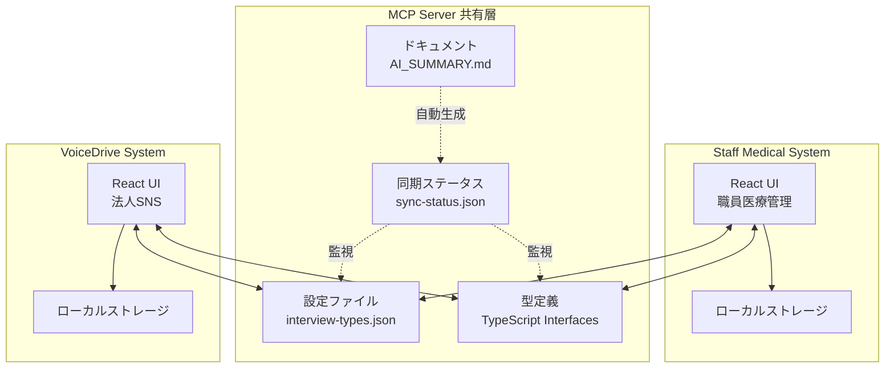
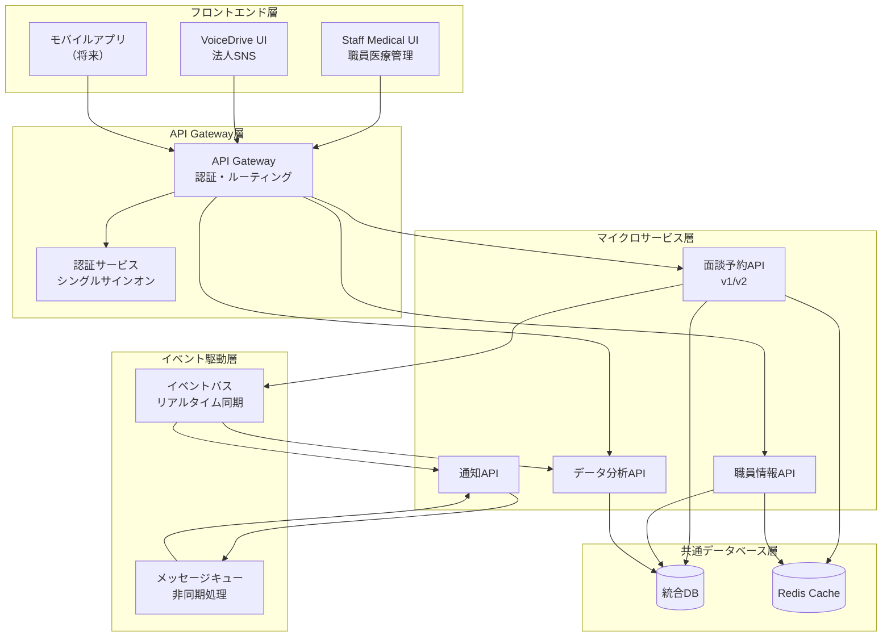
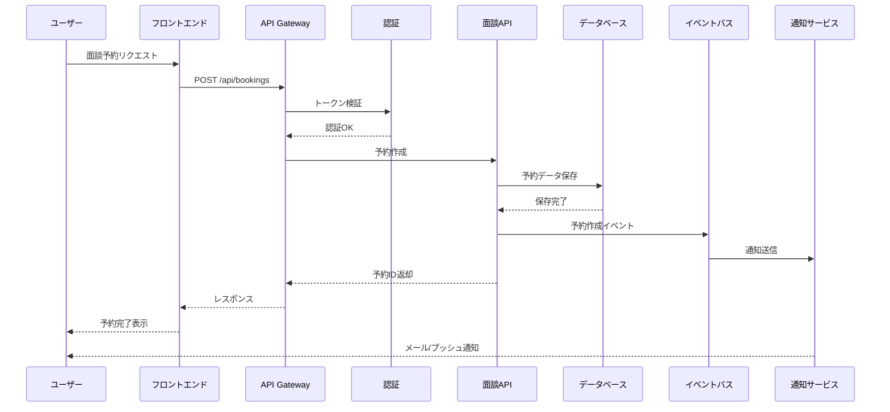
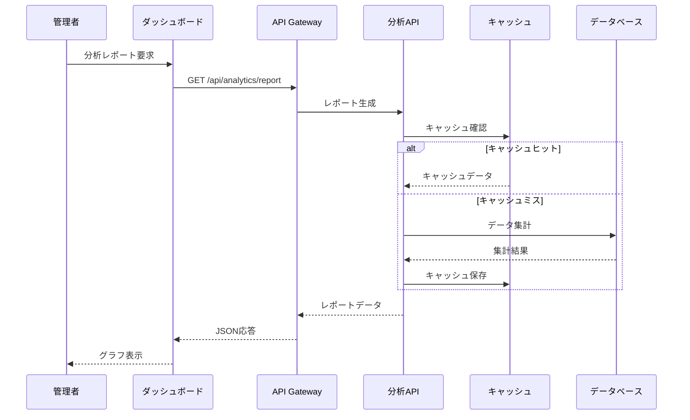
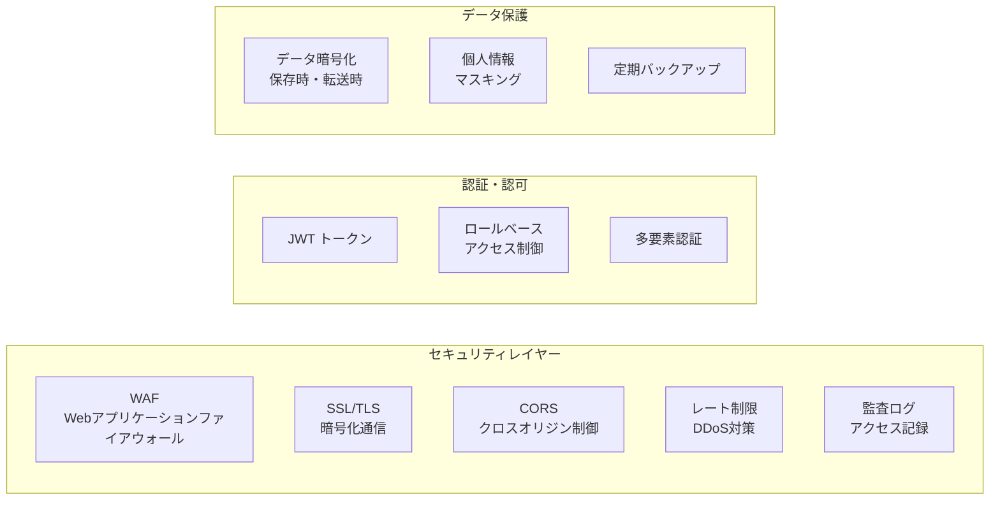

# システム連携アーキテクチャ図

## 現在のアーキテクチャ（Phase 1: フロントエンド開発段階）

## 将来のアーキテクチャ（Phase 2: 統合運用段階）

## データフロー例

### 1. 面談予約フロー

### 2. データ分析フロー

## 技術スタック

### 現在使用中
- **フロントエンド**: React, TypeScript, Tailwind CSS
- **状態管理**: ローカルストレージ
- **共有層**: MCPサーバー, JSON/TypeScript

### 将来導入予定
- **バックエンド**: Node.js/Express or FastAPI
- **データベース**: PostgreSQL
- **キャッシュ**: Redis
- **メッセージキュー**: RabbitMQ or AWS SQS
- **認証**: Auth0 or Keycloak
- **API Gateway**: Kong or AWS API Gateway
- **監視**: Prometheus + Grafana

## セキュリティ考慮事項

## スケーラビリティ戦略

1. **水平スケーリング**: マイクロサービスの複数インスタンス展開
2. **負荷分散**: ロードバランサーによるトラフィック分散
3. **データベース**: リードレプリカ、シャーディング
4. **キャッシング**: 多層キャッシュ戦略（CDN、Redis、アプリケーション）
5. **非同期処理**: メッセージキューによる重い処理の分離

## 移行計画

### Phase 1（現在）✅
- フロントエンド開発
- MCPサーバー経由の設定共有
- 型定義の統一

### Phase 2（次期）
- バックエンドAPI開発
- 共通データベース構築
- 認証システム実装

### Phase 3（将来）
- マイクロサービス化
- イベント駆動アーキテクチャ
- リアルタイム同期
- モバイルアプリ対応