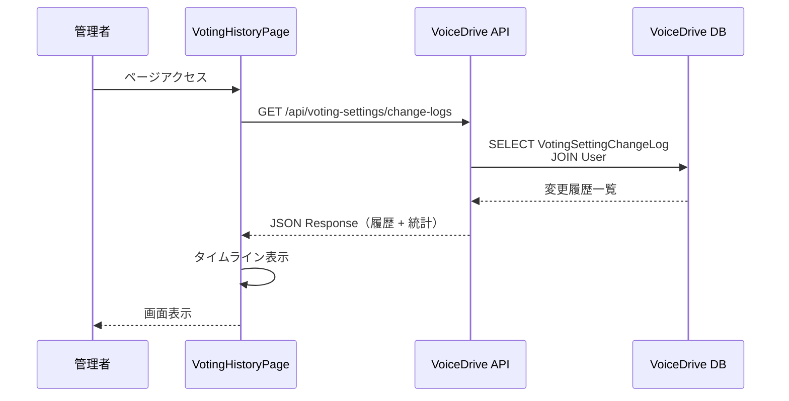
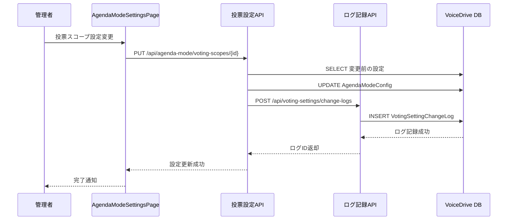
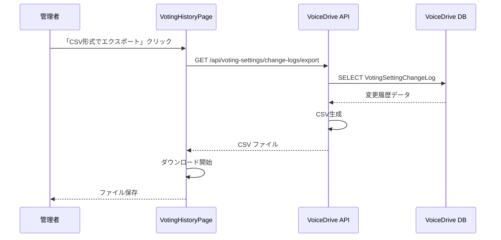

# 投票設定変更履歴ページ DB要件分析

**文書番号**: DB-REQ-2025-1021-004
**作成日**: 2025年10月21日
**最終更新**: 2025年10月21日
**分析対象**: 投票設定変更履歴ページ（/admin/voting-settings/history）
**分析者**: VoiceDriveチーム

---

## 📋 エグゼクティブサマリー

### 分析対象ページ
- **URL**: `https://voicedrive-v100.vercel.app/voting-history`
- **ファイル**: `src/pages/admin/VotingHistoryPage.tsx`
- **機能**: 投票設定（議題モード・プロジェクトモード）の変更履歴を時系列で表示

### 結論：🔴 新規テーブル追加が必要

| 項目 | 状態 | 詳細 |
|------|------|------|
| **DB実装** | 🔴 **不足** | 設定変更履歴を記録するテーブルが必要 |
| **データ管理責任** | 🟢 **VoiceDrive** | 医療システムは関与しない |
| **API必要性** | ⏳ **要実装** | 履歴記録・取得APIが必要 |
| **追加テーブル** | 🔴 **必要** | `VotingSettingChangeLog` テーブル |
| **schema.prisma更新** | 🔴 **必要** | 新規モデル追加 |

---

## 1. ページ機能分析

### 1.1 機能概要

投票設定変更履歴ページは、以下の機能を提供します：

#### 機能1: 変更履歴タイムライン表示 📜

**目的**: 投票設定の変更を時系列で表示

**表示内容** (`VotingHistoryPage.tsx` 13-80行目):
```typescript
{
  id: 1,
  date: '2025-10-13 14:30',
  mode: 'agenda',                    // 'agenda' | 'project'
  category: '投票スコープ設定',       // カテゴリ
  user: '山田 太郎',                 // 変更者
  userLevel: 99,                     // 変更者の権限レベル
  action: '看護部-看護科の投票パターンをパターンCからパターンAに変更',
  impact: '約80名に影響',            // 影響範囲
  status: 'active'                   // 'active' | 'reverted'
}
```

**変更カテゴリ例**:
- **議題モード**:
  - 投票スコープ設定
  - 投票グループ管理
  - 主承認者設定
  - 委員会提出設定

- **プロジェクトモード**:
  - チーム編成ルール
  - プロジェクト化閾値
  - 進捗管理設定
  - リソース配分ルール

#### 機能2: 統計情報表示 📊

**目的**: 変更履歴の統計を表示

**表示内容** (`VotingHistoryPage.tsx` 128-146行目):
```typescript
- 総変更回数: 6回
- 議題モード変更: 4回
- プロジェクトモード変更: 2回
```

#### 機能3: フィルタ機能 🔍

**目的**: 表示モード別にフィルタリング

**フィルタオプション**:
- すべて
- 議題モードのみ
- プロジェクトモードのみ

#### 機能4: アクション機能 ⚙️

**目的**: 履歴レコードに対する操作

**アクション**:
1. **詳細を表示**: 変更の詳細内容を表示
2. **この設定を確認**: 該当設定ページへジャンプ
3. **この時点に戻す**（将来実装）: ロールバック機能

#### 機能5: エクスポート機能 📤

**目的**: 監査証跡としてCSVエクスポート

**エクスポート内容**:
- 変更日時
- 変更者
- 変更内容
- 影響範囲

---

### 1.2 必要なデータソース

| 表示項目 | データソース | 管理責任 | 状態 |
|---------|-------------|---------|------|
| 変更日時 | `VotingSettingChangeLog.changedAt` | VoiceDrive | 🔴 未実装 |
| 変更モード | `VotingSettingChangeLog.mode` | VoiceDrive | 🔴 未実装 |
| 変更カテゴリ | `VotingSettingChangeLog.category` | VoiceDrive | 🔴 未実装 |
| 変更者 | `User.name` | 医療システム（キャッシュ） | ✅ 既存 |
| 変更者権限 | `User.permissionLevel` | 医療システム（キャッシュ） | ✅ 既存 |
| 変更内容 | `VotingSettingChangeLog.changeDescription` | VoiceDrive | 🔴 未実装 |
| 影響範囲 | `VotingSettingChangeLog.impactDescription` | VoiceDrive | 🔴 未実装 |
| 変更前の値 | `VotingSettingChangeLog.beforeValue` | VoiceDrive | 🔴 未実装 |
| 変更後の値 | `VotingSettingChangeLog.afterValue` | VoiceDrive | 🔴 未実装 |

---

## 2. データ管理責任分析

### 2.1 データ管理責任分界点定義書との整合性

**データ管理責任分界点定義書（20251008版）** より引用：

> **カテゴリ2: 組織情報**（行240-250）
>
> | データ項目 | VoiceDrive | 医療システム |
> |-----------|-----------|-------------|
> | **投票グループ** | ✅ マスタ | ❌ |
> | **投票設定** | ✅ マスタ | ❌ |

### 2.2 結論

| データカテゴリ | VoiceDrive | 医療システム | 理由 |
|--------------|-----------|-------------|------|
| **投票設定変更履歴** | ✅ **100%** | ❌ 0% | VoiceDrive独自機能の監査ログ |
| **変更者情報** | キャッシュ | ✅ マスタ | 医療システムから取得済み |

**医療システムとの関係**:
- 医療システムは関与しない
- VoiceDriveが100%責任を持つ
- 変更履歴はVoiceDrive内部で完結

---

## 3. 必要なテーブル設計

### 3.1 新規テーブル: `VotingSettingChangeLog`

#### 3.1.1 テーブル定義

```prisma
model VotingSettingChangeLog {
  id                  String    @id @default(cuid())

  // 変更基本情報
  mode                String    // 'agenda' | 'project' | 'both'
  category            String    // 変更カテゴリ
  subcategory         String?   // サブカテゴリ（詳細分類）

  // 変更内容
  changeDescription   String    @db.Text  // 変更内容の説明
  impactDescription   String?   @db.Text  // 影響範囲の説明

  // 変更前後の値（JSON）
  beforeValue         Json?     // 変更前の設定値
  afterValue          Json?     // 変更後の設定値

  // 変更者情報
  changedBy           String    // 変更者ユーザーID
  changedByLevel      Decimal   // 変更時の権限レベル
  changedAt           DateTime  @default(now())

  // ステータス
  status              String    @default("active")  // 'active' | 'reverted' | 'superseded'
  revertedAt          DateTime?
  revertedBy          String?
  revertReason        String?   @db.Text

  // 関連エンティティ
  relatedEntityType   String?   // 'VotingGroup' | 'AgendaModeConfig' | 'ProjectModeConfig'
  relatedEntityId     String?   // 関連エンティティのID

  // メタデータ
  metadata            Json?     // 追加情報（影響人数、関連部署など）

  // Relations
  user                User      @relation("SettingChangeUser", fields: [changedBy], references: [id])
  revertedByUser      User?     @relation("SettingRevertUser", fields: [revertedBy], references: [id])

  @@index([changedAt])
  @@index([mode])
  @@index([category])
  @@index([changedBy])
  @@index([status])
  @@index([mode, changedAt])
  @@index([relatedEntityType, relatedEntityId])
  @@map("voting_setting_change_logs")
}
```

#### 3.1.2 カテゴリ定義

**議題モード (`mode: 'agenda'`)**:
- `voting_scope_setting`: 投票スコープ設定
- `voting_group_management`: 投票グループ管理
- `primary_approver_setting`: 主承認者設定
- `committee_submission_setting`: 委員会提出設定
- `agenda_threshold_setting`: 議題昇格閾値設定

**プロジェクトモード (`mode: 'project'`)**:
- `team_formation_rule`: チーム編成ルール
- `project_threshold_setting`: プロジェクト化閾値
- `progress_management_setting`: 進捗管理設定
- `resource_allocation_rule`: リソース配分ルール
- `milestone_setting`: マイルストーン設定

#### 3.1.3 データ例

**例1: 投票スコープ設定変更**
```json
{
  "id": "LOG-2025-001",
  "mode": "agenda",
  "category": "voting_scope_setting",
  "subcategory": "pattern_change",
  "changeDescription": "看護部-看護科の投票パターンをパターンCからパターンAに変更",
  "impactDescription": "約80名に影響",
  "beforeValue": {
    "departmentId": "DEPT-001",
    "departmentName": "看護部-看護科",
    "votingPattern": "C",
    "votingPatternLabel": "パターンC（部署全体）"
  },
  "afterValue": {
    "departmentId": "DEPT-001",
    "departmentName": "看護部-看護科",
    "votingPattern": "A",
    "votingPatternLabel": "パターンA（配置単位）"
  },
  "changedBy": "USER-001",
  "changedByLevel": 99,
  "changedAt": "2025-10-13T14:30:00Z",
  "status": "active",
  "relatedEntityType": "AgendaModeConfig",
  "relatedEntityId": "CONFIG-001",
  "metadata": {
    "affectedUserCount": 80,
    "affectedDepartments": ["看護部-看護科"],
    "changeReason": "配置場所ごとの意見を反映するため"
  }
}
```

**例2: 投票グループ作成**
```json
{
  "id": "LOG-2025-002",
  "mode": "agenda",
  "category": "voting_group_management",
  "subcategory": "group_created",
  "changeDescription": "「小規模事務部門グループ」を新規作成（総務科、経理科、人事科）",
  "impactDescription": "22名が新グループに統合",
  "beforeValue": null,
  "afterValue": {
    "groupId": "GROUP-2024-001",
    "groupName": "小規模事務部門グループ",
    "memberDepartments": ["総務科", "経理科", "人事科"],
    "totalMembers": 22
  },
  "changedBy": "USER-001",
  "changedByLevel": 99,
  "changedAt": "2025-10-11T10:20:00Z",
  "status": "active",
  "relatedEntityType": "VotingGroup",
  "relatedEntityId": "GROUP-2024-001",
  "metadata": {
    "affectedUserCount": 22,
    "affectedDepartments": ["総務科", "経理科", "人事科"]
  }
}
```

**例3: 主承認者ローテーション変更**
```json
{
  "id": "LOG-2025-003",
  "mode": "agenda",
  "category": "primary_approver_setting",
  "subcategory": "rotation_period_changed",
  "changeDescription": "リハ専門職グループのローテーション期間を月次から四半期に変更",
  "impactDescription": "3名の承認者に影響",
  "beforeValue": {
    "groupId": "GROUP-2024-002",
    "groupName": "リハ専門職グループ",
    "rotationType": "monthly",
    "approverCount": 3
  },
  "afterValue": {
    "groupId": "GROUP-2024-002",
    "groupName": "リハ専門職グループ",
    "rotationType": "quarterly",
    "approverCount": 3
  },
  "changedBy": "USER-001",
  "changedByLevel": 99,
  "changedAt": "2025-10-10T09:45:00Z",
  "status": "active",
  "relatedEntityType": "VotingGroup",
  "relatedEntityId": "GROUP-2024-002",
  "metadata": {
    "affectedApprovers": ["USER-010", "USER-011", "USER-012"],
    "changeReason": "承認者の負担軽減のため"
  }
}
```

**例4: プロジェクト化閾値変更**
```json
{
  "id": "LOG-2025-004",
  "mode": "project",
  "category": "project_threshold_setting",
  "subcategory": "facility_threshold_changed",
  "changeDescription": "施設プロジェクト化の閾値を500点から400点に引き下げ",
  "impactDescription": "プロジェクト化しやすくなる",
  "beforeValue": {
    "level": "facility",
    "threshold": 500
  },
  "afterValue": {
    "level": "facility",
    "threshold": 400
  },
  "changedBy": "USER-001",
  "changedByLevel": 99,
  "changedAt": "2025-10-09T15:30:00Z",
  "status": "active",
  "relatedEntityType": "ProjectModeConfig",
  "relatedEntityId": "CONFIG-002",
  "metadata": {
    "changeReason": "プロジェクト推進を加速するため"
  }
}
```

---

### 3.2 Userモデル更新

**必要な変更**:

```prisma
model User {
  // ... 既存フィールド

  // 🆕 投票設定変更履歴 Relations
  settingChanges      VotingSettingChangeLog[]  @relation("SettingChangeUser")
  settingReverts      VotingSettingChangeLog[]  @relation("SettingRevertUser")
}
```

---

## 4. API要件分析

### 4.1 必要なAPI

#### API 1: 変更履歴一覧取得

**エンドポイント**: `GET /api/voting-settings/change-logs`

**目的**: 変更履歴の一覧を取得

**リクエスト**:
```http
GET /api/voting-settings/change-logs?mode=all&page=1&limit=50
Authorization: Bearer {jwt}
```

**クエリパラメータ**:
- `mode`: `all` | `agenda` | `project`
- `page`: ページ番号（デフォルト: 1）
- `limit`: 1ページあたりの件数（デフォルト: 50）
- `startDate`: 開始日（オプション）
- `endDate`: 終了日（オプション）

**レスポンス**:
```json
{
  "logs": [
    {
      "id": "LOG-2025-001",
      "date": "2025-10-13T14:30:00Z",
      "mode": "agenda",
      "category": "投票スコープ設定",
      "user": "山田 太郎",
      "userLevel": 99,
      "action": "看護部-看護科の投票パターンをパターンCからパターンAに変更",
      "impact": "約80名に影響",
      "status": "active"
    }
  ],
  "statistics": {
    "totalCount": 6,
    "agendaModeCount": 4,
    "projectModeCount": 2
  },
  "pagination": {
    "page": 1,
    "limit": 50,
    "totalPages": 1,
    "hasNext": false
  }
}
```

**データソース**:
- `VotingSettingChangeLog` テーブル
- `User` テーブル（変更者情報）

**実装状況**: ⏳ **未実装** - 要実装

---

#### API 2: 変更履歴詳細取得

**エンドポイント**: `GET /api/voting-settings/change-logs/{logId}`

**目的**: 特定の変更履歴の詳細を取得

**リクエスト**:
```http
GET /api/voting-settings/change-logs/LOG-2025-001
Authorization: Bearer {jwt}
```

**レスポンス**:
```json
{
  "id": "LOG-2025-001",
  "mode": "agenda",
  "category": "投票スコープ設定",
  "subcategory": "パターン変更",
  "changeDescription": "看護部-看護科の投票パターンをパターンCからパターンAに変更",
  "impactDescription": "約80名に影響",
  "beforeValue": {
    "departmentId": "DEPT-001",
    "departmentName": "看護部-看護科",
    "votingPattern": "C",
    "votingPatternLabel": "パターンC（部署全体）"
  },
  "afterValue": {
    "departmentId": "DEPT-001",
    "departmentName": "看護部-看護科",
    "votingPattern": "A",
    "votingPatternLabel": "パターンA（配置単位）"
  },
  "changedBy": {
    "id": "USER-001",
    "name": "山田 太郎",
    "permissionLevel": 99
  },
  "changedAt": "2025-10-13T14:30:00Z",
  "status": "active",
  "metadata": {
    "affectedUserCount": 80,
    "affectedDepartments": ["看護部-看護科"],
    "changeReason": "配置場所ごとの意見を反映するため"
  }
}
```

**実装状況**: ⏳ **未実装** - 要実装

---

#### API 3: 変更履歴記録（内部API）

**エンドポイント**: `POST /api/voting-settings/change-logs`

**目的**: 設定変更時に自動的に履歴を記録

**リクエスト**:
```http
POST /api/voting-settings/change-logs
Authorization: Bearer {jwt}
Content-Type: application/json
```

```json
{
  "mode": "agenda",
  "category": "voting_scope_setting",
  "subcategory": "pattern_change",
  "changeDescription": "看護部-看護科の投票パターンをパターンCからパターンAに変更",
  "impactDescription": "約80名に影響",
  "beforeValue": { /* ... */ },
  "afterValue": { /* ... */ },
  "relatedEntityType": "AgendaModeConfig",
  "relatedEntityId": "CONFIG-001",
  "metadata": { /* ... */ }
}
```

**レスポンス**:
```json
{
  "success": true,
  "logId": "LOG-2025-001",
  "createdAt": "2025-10-13T14:30:00Z"
}
```

**実装状況**: ⏳ **未実装** - 要実装

**呼び出しタイミング**:
- `PUT /api/agenda-mode/voting-scopes/{id}` の成功後
- `POST /api/agenda-mode/voting-groups` の成功後
- `PUT /api/agenda-mode/voting-groups/{id}/approver-rotation` の成功後
- その他、投票設定変更API実行時

---

#### API 4: 履歴エクスポート

**エンドポイント**: `GET /api/voting-settings/change-logs/export`

**目的**: CSV形式で履歴をエクスポート

**リクエスト**:
```http
GET /api/voting-settings/change-logs/export?mode=all&startDate=2025-01-01&endDate=2025-12-31
Authorization: Bearer {jwt}
```

**レスポンス**: CSV形式
```csv
変更日時,モード,カテゴリ,変更者,権限レベル,変更内容,影響範囲,ステータス
2025-10-13 14:30,議題モード,投票スコープ設定,山田 太郎,99,看護部-看護科の投票パターンをパターンCからパターンAに変更,約80名に影響,active
2025-10-11 10:20,議題モード,投票グループ管理,山田 太郎,99,「小規模事務部門グループ」を新規作成（総務科、経理科、人事科）,22名が新グループに統合,active
```

**実装状況**: ⏳ **未実装** - 要実装

---

### 4.2 外部API（医療システムへのAPI呼び出し）

**結論**: ❌ **不要**

理由:
- 投票設定変更履歴はVoiceDrive独自機能
- 医療システムは関与しない
- 変更者情報は既にUserテーブルにキャッシュ済み

---

## 5. 不足項目の洗い出し

### 5.1 データベース（schema.prisma）

| 項目 | 状態 | 詳細 |
|------|------|------|
| テーブル追加 | 🔴 **必要** | `VotingSettingChangeLog` テーブル |
| フィールド追加 | 🔴 **必要** | `User` モデルにRelation追加 |
| インデックス追加 | 🔴 **必要** | 変更日時・モード・カテゴリのインデックス |

**必要な追加内容**:

```prisma
// 新規モデル
model VotingSettingChangeLog {
  // 前述の定義
}

// Userモデル更新
model User {
  // ... 既存フィールド
  settingChanges      VotingSettingChangeLog[]  @relation("SettingChangeUser")
  settingReverts      VotingSettingChangeLog[]  @relation("SettingRevertUser")
}
```

---

### 5.2 API実装

| API | 状態 | 優先度 |
|-----|------|--------|
| GET `/api/voting-settings/change-logs` | ⏳ 未実装 | 🔴 高 |
| GET `/api/voting-settings/change-logs/{id}` | ⏳ 未実装 | 🟡 中 |
| POST `/api/voting-settings/change-logs` | ⏳ 未実装 | 🔴 高 |
| GET `/api/voting-settings/change-logs/export` | ⏳ 未実装 | 🟢 低 |

---

### 5.3 フロントエンド実装

| 項目 | 状態 | 詳細 |
|------|------|------|
| ページUI | ✅ 完了 | `VotingHistoryPage.tsx` 実装済み |
| データ取得ロジック | 🔴 未実装 | APIコール処理が必要 |
| 詳細モーダル | 🔴 未実装 | 変更詳細表示モーダルが必要 |
| エクスポート機能 | 🔴 未実装 | CSV出力機能が必要 |

---

### 5.4 自動ログ記録の統合

**必要な作業**:

既存の投票設定変更APIに、自動ログ記録処理を追加：

```typescript
// 例: src/api/routes/agenda-mode.routes.ts

router.put('/voting-scopes/:departmentId', async (req, res) => {
  const { departmentId } = req.params;
  const { votingPattern, votingScopeRules } = req.body;
  const userId = req.user.id;

  // 変更前の値を取得
  const beforeConfig = await prisma.agendaModeConfig.findUnique({
    where: { departmentId },
    include: { department: true }
  });

  // 設定を更新
  const afterConfig = await prisma.agendaModeConfig.update({
    where: { departmentId },
    data: { votingScopeRules }
  });

  // 🆕 変更履歴を記録
  await prisma.votingSettingChangeLog.create({
    data: {
      mode: 'agenda',
      category: 'voting_scope_setting',
      subcategory: 'pattern_change',
      changeDescription: `${beforeConfig.department.departmentName}の投票パターンを${beforeConfig.votingScopeRules.pattern}から${votingPattern}に変更`,
      impactDescription: `約${beforeConfig.department.memberCount}名に影響`,
      beforeValue: beforeConfig.votingScopeRules,
      afterValue: votingScopeRules,
      changedBy: userId,
      changedByLevel: req.user.permissionLevel,
      relatedEntityType: 'AgendaModeConfig',
      relatedEntityId: departmentId,
      metadata: {
        affectedUserCount: beforeConfig.department.memberCount,
        affectedDepartments: [beforeConfig.department.departmentName]
      }
    }
  });

  res.json({ success: true, updated: afterConfig });
});
```

**統合が必要なAPI**:
1. `PUT /api/agenda-mode/voting-scopes/{id}`
2. `POST /api/agenda-mode/voting-groups`
3. `PUT /api/agenda-mode/voting-groups/{id}`
4. `PUT /api/agenda-mode/voting-groups/{id}/approver-rotation`
5. `DELETE /api/agenda-mode/voting-groups/{id}`
6. プロジェクトモード設定API（全て）

---

## 6. 実装優先度

### 6.1 Phase 1: 基本履歴表示（優先度：🔴 高）

**目的**: 変更履歴を表示できるようにする

**実装内容**:
1. 🔴 `VotingSettingChangeLog` テーブル追加
2. 🔴 マイグレーション実行
3. 🔴 GET `/api/voting-settings/change-logs` API実装
4. 🔴 ページのデータ取得ロジック実装
5. 🔴 統計情報の集計処理

**予定工数**: 2-3日

---

### 6.2 Phase 2: 自動ログ記録（優先度：🔴 高）

**目的**: 設定変更時に自動的に履歴を記録

**実装内容**:
1. 🔴 POST `/api/voting-settings/change-logs` API実装
2. 🔴 既存の設定変更APIに自動ログ記録を統合
3. 🔴 ログ記録のテスト

**予定工数**: 3-4日

---

### 6.3 Phase 3: 詳細表示機能（優先度：🟡 中）

**目的**: 変更の詳細を確認できるようにする

**実装内容**:
1. 🟡 GET `/api/voting-settings/change-logs/{id}` API実装
2. 🟡 詳細モーダル実装
3. 🟡 変更前後の値の比較表示

**予定工数**: 2日

---

### 6.4 Phase 4: エクスポート機能（優先度：🟢 低）

**目的**: 監査証跡としてエクスポート

**実装内容**:
1. 🟢 GET `/api/voting-settings/change-logs/export` API実装
2. 🟢 CSV生成処理
3. 🟢 ダウンロード機能実装

**予定工数**: 1-2日

---

## 7. データフロー図

### フロー1: 変更履歴一覧表示



---

### フロー2: 設定変更時の自動ログ記録



---

### フロー3: 変更履歴エクスポート



---

## 8. セキュリティ・権限

### 8.1 アクセス制御

| 操作 | 必要権限レベル | 備考 |
|------|--------------|------|
| 履歴閲覧 | permissionLevel >= 10 | 部門長以上 |
| 履歴詳細表示 | permissionLevel >= 10 | 部門長以上 |
| 履歴エクスポート | permissionLevel >= 15 | 施設管理者以上 |
| ロールバック（将来） | permissionLevel >= 20 | 経営層のみ |

### 8.2 監査ログの保持期間

- **保持期間**: 永久保存（削除不可）
- **アーカイブ**: 2年以上経過したログはアーカイブテーブルへ移行（オプション）

---

## 9. まとめ

### 9.1 結論

| 項目 | 結論 |
|------|------|
| **データ管理責任** | ✅ VoiceDrive 100% |
| **DB実装** | 🔴 新規テーブル追加必要 |
| **schema.prisma更新** | 🔴 必要 |
| **医療システムAPI** | ❌ 不要 |
| **VoiceDrive API** | ⏳ 要実装（4エンドポイント） |
| **既存API統合** | 🔴 必要（自動ログ記録） |
| **フロントエンド** | ⏳ 要実装（データ取得・詳細表示） |

### 9.2 次のステップ

1. ✅ **本ドキュメント作成完了**
2. ⏳ **暫定マスターリスト作成**（次工程）
3. ⏳ **schema.prisma更新** - `VotingSettingChangeLog`モデル追加
4. ⏳ **マイグレーション実行**
5. ⏳ **API実装** - Phase 1から順次実装
6. ⏳ **既存API統合** - 自動ログ記録追加
7. ⏳ **フロントエンド実装** - データ取得ロジック追加
8. ⏳ **統合テスト** - 全機能の動作確認

### 9.3 医療システムとの連携

**連絡不要**:
- 投票設定変更履歴はVoiceDrive独自機能の監査ログ
- 医療システムは関与しない
- 新規API開発・DB変更は医療システム側で不要

---

**文書終了**

**作成者**: VoiceDriveチーム
**承認**: 未承認（レビュー待ち）
**最終更新**: 2025年10月21日
