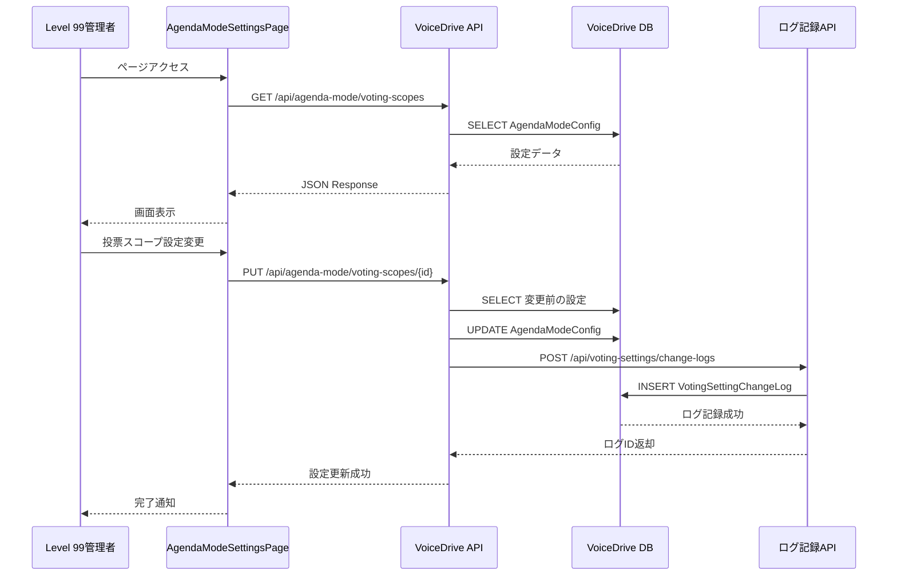
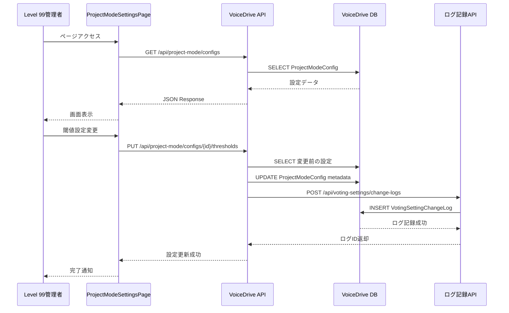
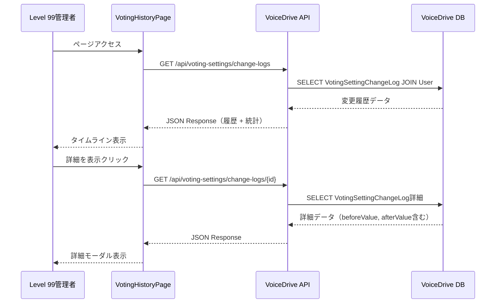

# 投票設定ページ DB要件分析

**文書番号**: DB-REQ-2025-1021-005
**作成日**: 2025年10月21日
**最終更新**: 2025年10月21日
**分析対象**: 投票設定ページ（/admin/voting-settings）
**分析者**: VoiceDriveチーム

---

## 📋 エグゼクティブサマリー

### 分析対象ページ

- **URL**: `https://voicedrive-v100.vercel.app/voting-settings`
- **親ファイル**: [src/pages/admin/VotingSettingsPage.tsx](src/pages/admin/VotingSettingsPage.tsx)
- **機能**: 投票設定の統合管理ページ（タブナビゲーション）

### ページ構成

投票設定ページは、React Routerの`<Outlet />`パターンを使用した**3つの子ページで構成**されています：

| タブ | 子ページ | URL | ファイル | 機能 | 分析状況 |
|------|---------|-----|---------|------|---------|
| 🗳️ 議題モード | AgendaModeSettingsPage | `/admin/voting-settings` | [AgendaModeSettingsPage.tsx](src/pages/admin/AgendaModeSettingsPage.tsx:1) | 投票スコープ・グループ・承認者ローテーション設定 | ✅ 完了 |
| 📋 プロジェクトモード | ProjectModeSettingsPage | `/admin/voting-settings/project` | [ProjectModeSettingsPage.tsx](src/pages/admin/ProjectModeSettingsPage.tsx:1) | 閾値・チーム編成・進捗管理設定 | 🆕 本文書で分析 |
| 📜 履歴 | VotingHistoryPage | `/admin/voting-settings/history` | [VotingHistoryPage.tsx](src/pages/admin/VotingHistoryPage.tsx:1) | 設定変更履歴の表示 | ✅ 完了 |

### 総合結論

| 項目 | 状態 | 詳細 |
|------|------|------|
| **DB実装（議題モード）** | ✅ **完了** | 必要なテーブルはすべて実装済み |
| **DB実装（プロジェクトモード）** | ✅ **完了** | 基本テーブル実装済み、JSON拡張で対応可能 |
| **DB実装（履歴）** | 🔴 **不足** | `VotingSettingChangeLog`テーブル追加が必要 |
| **データ管理責任** | 🟢 **VoiceDrive** | 100% VoiceDrive管理（医療システム関与なし） |
| **API必要性** | ⏳ **要実装** | 議題8本、プロジェクト8本、履歴4本 = **計20本** |
| **schema.prisma更新** | 🔴 **必要** | VotingSettingChangeLog追加、User Relations追加 |

---

## 1. ページ全体アーキテクチャ

### 1.1 親ページの役割

**ファイル**: [src/pages/admin/VotingSettingsPage.tsx](src/pages/admin/VotingSettingsPage.tsx:1-95) (95行)

**機能**: タブナビゲーションのみを提供（設定ロジックなし）

**重要コード** (VotingSettingsPage.tsx:40-50):
```tsx
const activeTab = location.pathname.includes('project')
  ? 'project'
  : location.pathname.includes('history')
  ? 'history'
  : 'agenda';

// 3つのタブナビゲーション
{/* 議題モード設定 */}
{/* プロジェクトモード設定 */}
{/* 変更履歴 */}

<Outlet /> // 子コンポーネントを表示
```

**データソース**: なし（ナビゲーションのみ）

---

## 2. 子ページ詳細分析

### 2.1 議題モード設定 ✅

**URL**: `/admin/voting-settings`
**ファイル**: [src/pages/admin/AgendaModeSettingsPage.tsx](src/pages/admin/AgendaModeSettingsPage.tsx:1-357) (357行)

#### 機能概要

1. **投票スコープ設定**（パターンA/B/C、議題昇格閾値）
2. **投票グループ管理**（小規模部署のグループ化）
3. **主承認者ローテーション設定**

#### 分析状況

✅ **完了**
- **分析文書**: `agenda-mode-settings_DB要件分析_20251021.md`
- **マスターリスト**: `agenda-mode-settings暫定マスターリスト_20251021.md`
- **結論**: 必要なテーブル・フィールドは100%実装済み
- **医療システム関与**: なし（VoiceDrive 100%管理）

#### 必要なテーブル（すべて実装済み）

- ✅ `VotingGroup` - 投票グループ管理
- ✅ `AgendaModeConfig` - 部署別議題モード設定
- ✅ `AgendaModeGroupConfig` - グループ別議題モード設定

---

### 2.2 プロジェクトモード設定 🆕

**URL**: `/admin/voting-settings/project`
**ファイル**: [src/pages/admin/ProjectModeSettingsPage.tsx](src/pages/admin/ProjectModeSettingsPage.tsx:1-420) (420行)

#### 機能概要

プロジェクトモード設定ページは**3つのセクション**で構成：

##### セクション1: 📊 プロジェクト化閾値設定 (ProjectModeSettingsPage.tsx:65-157)

**機能**: プロジェクト化の閾値を設定

**設定項目**:
- 部署プロジェクト化: 200点以上
- 施設プロジェクト化: 400点以上
- 法人プロジェクト化: 800点以上
- 緊急昇格設定（有効/無効、最低必要レベル）

**データ構造**:
```typescript
{
  thresholds: {
    department: 200,   // 部署プロジェクト化
    facility: 400,     // 施設プロジェクト化
    corporate: 800     // 法人プロジェクト化
  },
  emergencyEscalation: {
    enabled: true,
    requiredLevel: 8   // Level 8以上
  }
}
```

**UIコード例** (ProjectModeSettingsPage.tsx:88-94):
```tsx
<input
  type="number"
  defaultValue={200}
  className="w-24 px-3 py-2 bg-slate-800/50 border border-slate-600/50 rounded text-white text-center"
/>
<span className="text-slate-400">点以上</span>
```

---

##### セクション2: 👥 チーム編成ルール設定 (ProjectModeSettingsPage.tsx:160-294)

**機能**: プロジェクトチームの自動編成ルール設定

**設定項目**:

1. **チームサイズ**:
   - 最小チームサイズ: 3名
   - 推奨チームサイズ: 5名
   - 最大チームサイズ: 12名

2. **役割自動割り当て**:
   - プロジェクトリーダー: Level 5以上から自動選出
   - サブリーダー: Level 3以上から自動選出
   - 記録係: 全レベルから自動選出

3. **専門性考慮設定**:
   - 職種バランスを考慮
   - 関連部署を優先

**データ構造**:
```typescript
{
  teamSize: {
    min: 3,
    recommended: 5,
    max: 12
  },
  roleAssignment: {
    autoAssignLeader: true,
    autoAssignSubLeader: true,
    autoAssignRecorder: true,
    leaderMinLevel: 5,
    subLeaderMinLevel: 3
  },
  diversityRules: {
    considerSpecialtyBalance: true,
    prioritizeRelatedDepartments: true
  }
}
```

**UIコード例** (ProjectModeSettingsPage.tsx:183-191):
```tsx
<input
  type="number"
  defaultValue={3}
  min={2}
  max={10}
  className="w-20 px-3 py-2 bg-slate-800/50 border border-slate-600/50 rounded text-white text-center"
/>
<span className="text-slate-400">名</span>
```

---

##### セクション3: 📈 進捗管理設定 (ProjectModeSettingsPage.tsx:297-404)

**機能**: プロジェクト進捗管理とマイルストーン設定

**設定項目**:

1. **デフォルトマイルストーン**:
   - キックオフ: プロジェクト開始後3日以内
   - 計画書作成: キックオフ後7日以内
   - 中間報告: プロジェクト期間の50%時点
   - 最終報告: プロジェクト終了前7日

2. **進捗通知設定**:
   - 期限前通知: 3日前
   - 遅延アラート: 有効
   - 週次進捗レポート: 有効

**データ構造**:
```typescript
{
  milestones: [
    { key: 'kickoff', label: 'キックオフ', daysAfterStart: 3 },
    { key: 'plan', label: '計画書作成', daysAfterKickoff: 7 },
    { key: 'midreport', label: '中間報告', percentagePoint: 50 },
    { key: 'final', label: '最終報告', daysBeforeEnd: 7 }
  ],
  notifications: {
    deadlineReminder: true,
    deadlineReminderDays: 3,
    delayAlert: true,
    weeklyReport: true
  }
}
```

**UIコード例** (ProjectModeSettingsPage.tsx:313-322):
```tsx
<div className="flex items-center justify-between p-3 bg-slate-800/50 border border-slate-600/30 rounded">
  <div className="flex items-center space-x-3">
    <span className="text-2xl">🎯</span>
    <div>
      <div className="text-sm font-medium text-slate-300">キックオフ</div>
      <div className="text-xs text-slate-400 mt-1">プロジェクト開始後 3日以内</div>
    </div>
  </div>
  <button className="text-blue-400 hover:text-blue-300 text-sm">編集</button>
</div>
```

---

#### データソース分析

| UI表示項目 | データソース | 現状 |
|-----------|-------------|------|
| **閾値設定** |
| 部署プロジェクト閾値 | `ProjectModeConfig.projectUpgradeThreshold` | ✅ 既存 |
| 施設プロジェクト閾値 | `ProjectModeConfig.metadata.thresholds.facility` | 🟡 JSON拡張 |
| 法人プロジェクト閾値 | `ProjectModeConfig.metadata.thresholds.corporate` | 🟡 JSON拡張 |
| 緊急昇格設定 | `ProjectModeConfig.metadata.emergencyEscalation` | 🟡 JSON拡張 |
| **チーム編成** |
| チームサイズ設定 | `ProjectModeConfig.teamFormationRules.teamSize` | ✅ 既存（JSON） |
| 役割自動割り当て | `ProjectModeConfig.teamFormationRules.roleAssignment` | ✅ 既存（JSON） |
| 専門性考慮設定 | `ProjectModeConfig.teamFormationRules.diversityRules` | ✅ 既存（JSON） |
| **進捗管理** |
| マイルストーン設定 | `ProjectModeConfig.metadata.milestones` | 🟡 JSON拡張 |
| 進捗通知設定 | `ProjectModeConfig.metadata.notifications` | 🟡 JSON拡張 |
| 週次レポート頻度 | `ProjectModeConfig.progressReportFrequency` | ✅ 既存 |

---

#### 現在のスキーマ構造

[schema.prisma](prisma/schema.prisma:1915-1930):
```prisma
model ProjectModeConfig {
  id                      String                @id @default(cuid())
  departmentId            String                @unique
  projectUpgradeThreshold Int                   @default(400)
  teamFormationRules      Json
  milestoneRequired       Boolean               @default(true)
  progressReportFrequency String                @default("weekly")
  isActive                Boolean               @default(true)
  metadata                Json?
  createdAt               DateTime              @default(now()) @map("created_at")
  updatedAt               DateTime              @updatedAt @map("updated_at")
  department              OrganizationStructure @relation(fields: [departmentId], references: [departmentId], onDelete: Cascade)

  @@index([departmentId])
  @@map("project_mode_configs")
}
```

**結論**: ✅ スキーマ変更不要（JSONフィールドの拡張で対応可能）

---

### 2.3 設定変更履歴 ✅

**URL**: `/admin/voting-settings/history`
**ファイル**: [src/pages/admin/VotingHistoryPage.tsx](src/pages/admin/VotingHistoryPage.tsx:1-265) (265行)

#### 機能概要

1. **変更履歴タイムライン表示**（議題モード・プロジェクトモード）
2. **統計情報表示**（総変更回数、モード別変更回数）
3. **フィルタ機能**（すべて/議題モード/プロジェクトモード）
4. **アクション機能**（詳細表示、設定確認、ロールバック）
5. **CSVエクスポート**

#### 分析状況

✅ **完了**
- **分析文書**: `voting-history_DB要件分析_20251021.md`
- **必要なテーブル**: `VotingSettingChangeLog`（🔴 新規追加が必要）
- **医療システム関与**: なし（VoiceDrive 100%管理）

#### 必要なテーブル（未実装）

🔴 **`VotingSettingChangeLog`** - 設定変更履歴テーブル（新規作成が必要）

---

## 3. データ管理責任分析

### 3.1 データ管理責任分界点定義書との整合性

**データ管理責任分界点定義書（20251008版）** より引用：

> **カテゴリ2: 組織情報**（行240-250）
>
> | データ項目 | VoiceDrive | 医療システム |
> |-----------|-----------|-------------|
> | **投票グループ** | ✅ マスタ | ❌ |
> | **投票設定** | ✅ マスタ | ❌ |

### 3.2 結論

| データカテゴリ | VoiceDrive | 医療システム | 理由 |
|--------------|-----------|-------------|------|
| **議題モード設定** | ✅ **100%** | ❌ 0% | VoiceDrive独自の投票設定機能 |
| **プロジェクトモード設定** | ✅ **100%** | ❌ 0% | VoiceDrive独自のプロジェクト管理設定 |
| **設定変更履歴** | ✅ **100%** | ❌ 0% | VoiceDrive独自の監査ログ |
| **設定変更者情報** | キャッシュ | ✅ マスタ | 医療システムから取得済みUserデータを参照 |

**医療システムとの関係**:
- 医療システムは投票設定機能に一切関与しない
- すべてVoiceDriveが100%責任を持つ
- 医療システムへのAPI呼び出しは不要

---

## 4. 必要なテーブル設計

### 4.1 既存テーブル（実装済み）

#### 4.1.1 VotingGroup（議題モード）

[schema.prisma](prisma/schema.prisma:1807-1841):
```prisma
model VotingGroup {
  id                      String   @id @default(cuid())
  groupId                 String   @unique
  groupName               String
  groupType               String
  // ... 他フィールド
}
```

**状態**: ✅ 実装済み

---

#### 4.1.2 AgendaModeConfig（議題モード）

[schema.prisma](prisma/schema.prisma:1873-1888):
```prisma
model AgendaModeConfig {
  id                      String   @id @default(cuid())
  departmentId            String   @unique
  votingScopeRules        Json
  agendaUpgradeThreshold  Int      @default(200)
  // ... 他フィールド
}
```

**状態**: ✅ 実装済み

---

#### 4.1.3 ProjectModeConfig（プロジェクトモード）

[schema.prisma](prisma/schema.prisma:1915-1930):
```prisma
model ProjectModeConfig {
  id                      String   @id @default(cuid())
  departmentId            String   @unique
  projectUpgradeThreshold Int      @default(400)
  teamFormationRules      Json
  milestoneRequired       Boolean  @default(true)
  progressReportFrequency String   @default("weekly")
  metadata                Json?
  // ... 他フィールド
}
```

**状態**: ✅ 実装済み

**必要なJSON拡張**:

1. **metadata.thresholds** - 閾値設定
```json
{
  "department": 200,
  "facility": 400,
  "corporate": 800
}
```

2. **metadata.emergencyEscalation** - 緊急昇格設定
```json
{
  "enabled": true,
  "requiredLevel": 8
}
```

3. **metadata.milestones** - マイルストーン設定
```json
[
  { "key": "kickoff", "label": "キックオフ", "daysAfterStart": 3 },
  { "key": "plan", "label": "計画書作成", "daysAfterKickoff": 7 },
  { "key": "midreport", "label": "中間報告", "percentagePoint": 50 },
  { "key": "final", "label": "最終報告", "daysBeforeEnd": 7 }
]
```

4. **metadata.notifications** - 通知設定
```json
{
  "deadlineReminder": true,
  "deadlineReminderDays": 3,
  "delayAlert": true,
  "weeklyReport": true
}
```

5. **teamFormationRules** - チーム編成ルール
```json
{
  "teamSize": { "min": 3, "recommended": 5, "max": 12 },
  "roleAssignment": {
    "autoAssignLeader": true,
    "autoAssignSubLeader": true,
    "autoAssignRecorder": true,
    "leaderMinLevel": 5,
    "subLeaderMinLevel": 3
  },
  "diversityRules": {
    "considerSpecialtyBalance": true,
    "prioritizeRelatedDepartments": true
  }
}
```

---

### 4.2 新規テーブル（未実装）

#### 4.2.1 VotingSettingChangeLog（設定変更履歴）

**必要性**: 🔴 **必須**

**定義**:
```prisma
model VotingSettingChangeLog {
  id                  String    @id @default(cuid())

  // 変更基本情報
  mode                String    // 'agenda' | 'project' | 'both'
  category            String    // 変更カテゴリ
  subcategory         String?   // サブカテゴリ（詳細分類）

  // 変更内容
  changeDescription   String    @db.Text  // 変更内容の説明
  impactDescription   String?   @db.Text  // 影響範囲の説明

  // 変更前後の値（JSON）
  beforeValue         Json?     // 変更前の設定値
  afterValue          Json?     // 変更後の設定値

  // 変更者情報
  changedBy           String    // 変更者ユーザーID
  changedByLevel      Decimal   // 変更時の権限レベル
  changedAt           DateTime  @default(now())

  // ステータス
  status              String    @default("active")  // 'active' | 'reverted' | 'superseded'
  revertedAt          DateTime?
  revertedBy          String?
  revertReason        String?   @db.Text

  // 関連エンティティ
  relatedEntityType   String?   // 'VotingGroup' | 'AgendaModeConfig' | 'ProjectModeConfig'
  relatedEntityId     String?   // 関連エンティティのID

  // メタデータ
  metadata            Json?     // 追加情報（影響人数、関連部署など）

  // Relations
  user                User      @relation("SettingChangeUser", fields: [changedBy], references: [id])
  revertedByUser      User?     @relation("SettingRevertUser", fields: [revertedBy], references: [id])

  @@index([changedAt])
  @@index([mode])
  @@index([category])
  @@index([changedBy])
  @@index([status])
  @@index([mode, changedAt])
  @@index([relatedEntityType, relatedEntityId])
  @@map("voting_setting_change_logs")
}
```

**カテゴリ定義**:

**議題モード** (`mode: 'agenda'`):
- `voting_scope_setting`: 投票スコープ設定
- `voting_group_management`: 投票グループ管理
- `primary_approver_setting`: 主承認者設定
- `agenda_threshold_setting`: 議題昇格閾値設定

**プロジェクトモード** (`mode: 'project'`):
- `team_formation_rule`: チーム編成ルール
- `project_threshold_setting`: プロジェクト化閾値
- `progress_management_setting`: 進捗管理設定
- `milestone_setting`: マイルストーン設定

---

### 4.3 Userモデル更新

**必要な変更**:

```prisma
model User {
  // ... 既存フィールド

  // 🆕 投票設定変更履歴 Relations
  settingChanges      VotingSettingChangeLog[]  @relation("SettingChangeUser")
  settingReverts      VotingSettingChangeLog[]  @relation("SettingRevertUser")
}
```

---

## 5. API要件分析

### 5.1 議題モード設定API（8本）

分析済み文書: `agenda-mode-settings暫定マスターリスト_20251021.md`

| # | API名 | エンドポイント | メソッド | 優先度 | 推定工数 |
|---|-------|--------------|---------|--------|---------|
| 1 | 投票スコープ設定一覧取得 | `/api/agenda-mode/voting-scopes` | GET | 🔴 高 | 1.5日 |
| 2 | 投票スコープ設定更新 | `/api/agenda-mode/voting-scopes/{departmentId}` | PUT | 🔴 高 | 1.5日 |
| 3 | 投票グループ一覧取得 | `/api/agenda-mode/voting-groups` | GET | 🔴 高 | 1.5日 |
| 4 | 投票グループ作成 | `/api/agenda-mode/voting-groups` | POST | 🔴 高 | 1.5日 |
| 5 | 投票グループ更新 | `/api/agenda-mode/voting-groups/{groupId}` | PUT | 🔴 高 | 1.5日 |
| 6 | 投票グループ削除 | `/api/agenda-mode/voting-groups/{groupId}` | DELETE | 🟡 中 | 1日 |
| 7 | 主承認者ローテーション設定取得 | `/api/agenda-mode/voting-groups/{groupId}/approver-rotation` | GET | 🔴 高 | 1日 |
| 8 | 主承認者ローテーション設定更新 | `/api/agenda-mode/voting-groups/{groupId}/approver-rotation` | PUT | 🔴 高 | 1.5日 |

**小計**: 10.5日

---

### 5.2 プロジェクトモード設定API（8本）

#### API 1: プロジェクトモード設定一覧取得

**エンドポイント**: `GET /api/project-mode/configs`

**目的**: 全部署のプロジェクトモード設定を取得

**レスポンス例**:
```json
{
  "configs": [
    {
      "id": "CONFIG-001",
      "departmentId": "DEPT-001",
      "departmentName": "看護部-看護科",
      "projectUpgradeThreshold": 200,
      "teamFormationRules": { /* ... */ },
      "metadata": { /* ... */ }
    }
  ]
}
```

**優先度**: 🔴 高
**推定工数**: 1.5日

---

#### API 2: プロジェクトモード設定詳細取得

**エンドポイント**: `GET /api/project-mode/configs/{departmentId}`

**目的**: 特定部署のプロジェクトモード設定を取得

**優先度**: 🔴 高
**推定工数**: 1日

---

#### API 3: 閾値設定更新

**エンドポイント**: `PUT /api/project-mode/configs/{departmentId}/thresholds`

**リクエスト例**:
```json
{
  "thresholds": {
    "department": 200,
    "facility": 400,
    "corporate": 800
  },
  "emergencyEscalation": {
    "enabled": true,
    "requiredLevel": 8
  }
}
```

**優先度**: 🔴 高
**推定工数**: 1.5日

---

#### API 4: チーム編成ルール更新

**エンドポイント**: `PUT /api/project-mode/configs/{departmentId}/team-formation-rules`

**リクエスト例**:
```json
{
  "teamFormationRules": {
    "teamSize": { "min": 3, "recommended": 5, "max": 12 },
    "roleAssignment": {
      "autoAssignLeader": true,
      "leaderMinLevel": 5
    },
    "diversityRules": {
      "considerSpecialtyBalance": true
    }
  }
}
```

**優先度**: 🔴 高
**推定工数**: 1.5日

---

#### API 5: 進捗管理設定更新

**エンドポイント**: `PUT /api/project-mode/configs/{departmentId}/progress-management`

**リクエスト例**:
```json
{
  "milestoneRequired": true,
  "progressReportFrequency": "weekly",
  "milestones": [ /* ... */ ],
  "notifications": { /* ... */ }
}
```

**優先度**: 🔴 高
**推定工数**: 2日

---

#### API 6: プロジェクトモードグループ設定一覧取得

**エンドポイント**: `GET /api/project-mode/group-configs`

**優先度**: 🟡 中
**推定工数**: 1日

---

#### API 7: プロジェクトモードグループ設定更新

**エンドポイント**: `PUT /api/project-mode/group-configs/{groupId}`

**優先度**: 🟡 中
**推定工数**: 1.5日

---

#### API 8: デフォルト値取得

**エンドポイント**: `GET /api/project-mode/defaults`

**目的**: 新規部署作成時のデフォルト設定値を取得

**優先度**: 🟢 低
**推定工数**: 0.5日

---

**プロジェクトモードAPI小計**: 10.5日

---

### 5.3 設定変更履歴API（4本）

分析済み文書: `voting-history_DB要件分析_20251021.md`

| # | API名 | エンドポイント | メソッド | 優先度 | 推定工数 |
|---|-------|--------------|---------|--------|---------|
| 1 | 変更履歴一覧取得 | `/api/voting-settings/change-logs` | GET | 🔴 高 | 2.5日 |
| 2 | 変更履歴詳細取得 | `/api/voting-settings/change-logs/{logId}` | GET | 🟡 中 | 2日 |
| 3 | 変更履歴記録 | `/api/voting-settings/change-logs` | POST | 🔴 高 | 2日 |
| 4 | 履歴エクスポート | `/api/voting-settings/change-logs/export` | GET | 🟢 低 | 1.5日 |

**小計**: 8日

---

### 5.4 自動ログ記録の統合

**必要な作業**: 既存の投票設定変更APIに自動ログ記録処理を追加

**統合が必要なAPI**:
1. 議題モード設定API（8本）
2. プロジェクトモード設定API（8本）

**推定工数**: 3日

---

### 5.5 API総合計

| カテゴリ | API数 | 推定工数 |
|---------|------|---------|
| 議題モード設定 | 8本 | 10.5日 |
| プロジェクトモード設定 | 8本 | 10.5日 |
| 設定変更履歴 | 4本 | 8日 |
| 自動ログ記録統合 | - | 3日 |
| **合計** | **20本** | **32日** |

---

### 5.6 外部API（医療システムへのAPI呼び出し）

**結論**: ❌ **不要**

理由:
- 投票設定はVoiceDrive独自機能
- 医療システムは関与しない
- 設定変更者情報は既にUserテーブルにキャッシュ済み

---

## 6. 不足項目の洗い出し

### 6.1 データベース（schema.prisma）

| 項目 | 状態 | 詳細 |
|------|------|------|
| **VotingGroup** | ✅ 実装済み | 変更不要 |
| **AgendaModeConfig** | ✅ 実装済み | 変更不要 |
| **AgendaModeGroupConfig** | ✅ 実装済み | 変更不要 |
| **ProjectModeConfig** | ✅ 実装済み | JSON拡張で対応（スキーマ変更不要） |
| **ProjectModeGroupConfig** | ✅ 実装済み | JSON拡張で対応（スキーマ変更不要） |
| **VotingSettingChangeLog** | 🔴 **未実装** | **新規テーブル追加が必要** |
| **User Relations** | 🔴 **未実装** | settingChanges, settingReverts追加が必要 |

**必要な追加内容**:

```prisma
// 🆕 新規モデル
model VotingSettingChangeLog {
  // 前述の定義（セクション4.2.1参照）
}

// 🆕 Userモデル更新
model User {
  // ... 既存フィールド
  settingChanges      VotingSettingChangeLog[]  @relation("SettingChangeUser")
  settingReverts      VotingSettingChangeLog[]  @relation("SettingRevertUser")
}
```

---

### 6.2 TypeScript型定義

**推奨**: プロジェクトモード設定の型定義を明確化

**新規ファイル**: `src/types/project-mode-config.ts`

```typescript
// プロジェクトモード設定の型定義

export interface ProjectModeThresholds {
  department: number;   // 部署プロジェクト化閾値
  facility: number;     // 施設プロジェクト化閾値
  corporate: number;    // 法人プロジェクト化閾値
}

export interface EmergencyEscalationConfig {
  enabled: boolean;
  requiredLevel: number;
}

export interface TeamSizeRules {
  min: number;
  recommended: number;
  max: number;
}

export interface RoleAssignmentRules {
  autoAssignLeader: boolean;
  autoAssignSubLeader: boolean;
  autoAssignRecorder: boolean;
  leaderMinLevel: number;
  subLeaderMinLevel: number;
}

export interface DiversityRules {
  considerSpecialtyBalance: boolean;
  prioritizeRelatedDepartments: boolean;
}

export interface TeamFormationRules {
  teamSize: TeamSizeRules;
  roleAssignment: RoleAssignmentRules;
  diversityRules: DiversityRules;
}

export interface MilestoneConfig {
  key: string;
  label: string;
  daysAfterStart?: number;
  daysAfterKickoff?: number;
  percentagePoint?: number;
  daysBeforeEnd?: number;
}

export interface NotificationSettings {
  deadlineReminder: boolean;
  deadlineReminderDays: number;
  delayAlert: boolean;
  weeklyReport: boolean;
}

export interface ProjectModeMetadata {
  thresholds: ProjectModeThresholds;
  emergencyEscalation: EmergencyEscalationConfig;
  milestones: MilestoneConfig[];
  notifications: NotificationSettings;
}

export interface ProjectModeConfigData {
  id: string;
  departmentId: string;
  projectUpgradeThreshold: number;
  teamFormationRules: TeamFormationRules;
  milestoneRequired: boolean;
  progressReportFrequency: 'weekly' | 'biweekly' | 'monthly';
  isActive: boolean;
  metadata: ProjectModeMetadata;
  createdAt: Date;
  updatedAt: Date;
}
```

---

### 6.3 フロントエンド実装

#### 議題モード設定ページ

| 項目 | 状態 | 詳細 |
|------|------|------|
| ページUI | ✅ 完了 | AgendaModeSettingsPage.tsx実装済み |
| データ取得ロジック | 🔴 未実装 | APIコール処理が必要 |
| 設定更新ロジック | 🔴 未実装 | PUT APIコール処理が必要 |

**推定工数**: 3日

---

#### プロジェクトモード設定ページ

| 項目 | 状態 | 詳細 |
|------|------|------|
| ページUI | ✅ 完了 | ProjectModeSettingsPage.tsx実装済み |
| データ取得ロジック | 🔴 未実装 | GET APIコール処理が必要 |
| 閾値設定更新 | 🔴 未実装 | PUT APIコール処理が必要 |
| チーム編成ルール更新 | 🔴 未実装 | PUT APIコール処理が必要 |
| 進捗管理設定更新 | 🔴 未実装 | PUT APIコール処理が必要 |
| バリデーション処理 | 🔴 未実装 | 入力値検証が必要 |

**推定工数**: 3日

---

#### 設定変更履歴ページ

| 項目 | 状態 | 詳細 |
|------|------|------|
| ページUI | ✅ 完了 | VotingHistoryPage.tsx実装済み |
| データ取得ロジック | 🔴 未実装 | GET APIコール処理が必要 |
| 詳細モーダル | 🔴 未実装 | 変更詳細表示モーダルが必要 |
| エクスポート機能 | 🔴 未実装 | CSV出力機能が必要 |

**推定工数**: 2日

---

**フロントエンド総工数**: 3 + 3 + 2 = **8日**

---

## 7. 実装優先度とフェーズ

### Phase 1: 基盤整備（優先度：🔴 高）

**目的**: データベースとTypeScript型定義を整備

**実装内容**:
1. 🔴 `VotingSettingChangeLog` テーブル追加
2. 🔴 `User` モデルにRelations追加
3. 🔴 マイグレーション実行
4. 🔴 TypeScript型定義追加（`src/types/project-mode-config.ts`）

**予定工数**: 1-2日

---

### Phase 2: 議題モード設定機能（優先度：🔴 高）

**目的**: 議題モード設定のCRUD機能を実装

**実装内容**:
1. 🔴 議題モード設定API実装（8本）
2. 🔴 AgendaModeSettingsPageのデータ取得・更新ロジック実装
3. 🔴 バリデーション処理実装
4. 🔴 エラーハンドリング実装

**予定工数**: 10.5（API）+ 3（フロントエンド）= **13.5日**

---

### Phase 3: プロジェクトモード設定機能（優先度：🔴 高）

**目的**: プロジェクトモード設定のCRUD機能を実装

**実装内容**:
1. 🔴 プロジェクトモード設定API実装（8本）
2. 🔴 ProjectModeSettingsPageのデータ取得・更新ロジック実装
3. 🔴 バリデーション処理実装
4. 🔴 エラーハンドリング実装

**予定工数**: 10.5（API）+ 3（フロントエンド）= **13.5日**

---

### Phase 4: 設定変更履歴機能（優先度：🟡 中）

**目的**: 変更履歴の表示と自動ログ記録

**実装内容**:
1. 🔴 変更履歴API実装（4本）
2. 🔴 既存APIに自動ログ記録統合
3. 🔴 VotingHistoryPageのデータ取得ロジック実装
4. 🟡 詳細モーダル実装
5. 🟢 エクスポート機能実装

**予定工数**: 8（履歴API）+ 3（自動ログ統合）+ 2（フロントエンド）= **13日**

---

### Phase 5: テスト・最適化（優先度：🟡 中）

**目的**: 統合テストと性能最適化

**実装内容**:
1. 🟡 E2Eテスト実装
2. 🟡 単体テスト実装
3. 🟡 性能最適化
4. 🟡 ドキュメント整備

**予定工数**: 5日

---

### 総実装期間

**総工数**: 2（基盤）+ 13.5（議題）+ 13.5（プロジェクト）+ 13（履歴）+ 5（テスト）= **47日**

**推奨スケジュール**:
- Phase 1: 2日
- Phase 2: 14日（並行開発可能）
- Phase 3: 14日（Phase 2と並行開発可能）
- Phase 4: 13日
- Phase 5: 5日

**並行開発を考慮した総期間**: 約 **34日**（6.8週間）

---

## 8. データフロー図

### フロー1: 議題モード設定の取得・更新



---

### フロー2: プロジェクトモード設定の取得・更新



---

### フロー3: 設定変更履歴の表示



---

## 9. セキュリティ・権限

### 9.1 アクセス制御

| 操作 | 必要権限レベル | 対象ページ | 備考 |
|------|--------------|-----------|------|
| 投票設定閲覧 | permissionLevel >= 99 | 議題・プロジェクト | Level 99（経営層）のみ |
| 投票設定変更 | permissionLevel >= 99 | 議題・プロジェクト | Level 99（経営層）のみ |
| 履歴閲覧 | permissionLevel >= 10 | 履歴 | 部門長以上 |
| 履歴詳細表示 | permissionLevel >= 10 | 履歴 | 部門長以上 |
| 履歴エクスポート | permissionLevel >= 15 | 履歴 | 施設管理者以上 |
| ロールバック（将来） | permissionLevel >= 20 | 履歴 | 経営層のみ |

### 9.2 監査ログの保持期間

- **保持期間**: 永久保存（削除不可）
- **アーカイブ**: 2年以上経過したログはアーカイブテーブルへ移行（オプション）

### 9.3 変更通知

設定変更時に以下の通知を送信：
- Level 99管理者全員に通知
- 影響を受ける部署の部門長に通知
- 変更内容をSlack/メールで配信

---

## 10. まとめ

### 10.1 結論

| 項目 | 結論 |
|------|------|
| **データ管理責任** | ✅ VoiceDrive 100%（医療システム関与なし） |
| **DB実装（議題モード）** | ✅ 完了（追加作業不要） |
| **DB実装（プロジェクトモード）** | ✅ 完了（JSON拡張で対応可能） |
| **DB実装（履歴）** | 🔴 新規テーブル追加必要（VotingSettingChangeLog） |
| **schema.prisma更新** | 🔴 必要（VotingSettingChangeLog追加、User Relations追加） |
| **TypeScript型定義** | 🟡 推奨（project-mode-config.ts新規作成） |
| **医療システムAPI** | ❌ 不要 |
| **VoiceDrive API** | ⏳ 要実装（20エンドポイント） |
| **フロントエンド** | ⏳ データ取得・更新ロジック実装が必要 |
| **総実装工数** | **47日**（並行開発で約34日） |

---

### 10.2 次のステップ

1. ✅ **本ドキュメント作成完了**
2. ⏳ **暫定マスターリスト作成**（次工程）
3. ⏳ **schema.prisma更新**
   - `VotingSettingChangeLog` モデル追加
   - `User` モデルにRelations追加
4. ⏳ **TypeScript型定義追加**
   - `src/types/project-mode-config.ts` 作成
5. ⏳ **マイグレーション実行**
6. ⏳ **API実装**（Phase 2-4）
7. ⏳ **フロントエンド実装**（Phase 2-4）
8. ⏳ **統合テスト**（Phase 5）
9. ⏳ **ドキュメント整備**（Phase 5）

---

### 10.3 医療システムとの連携

**連絡不要**:
- 投票設定機能はVoiceDrive独自機能
- 医療システムは一切関与しない
- 新規API開発・DB変更は医療システム側で不要
- 設定変更者情報は既にキャッシュ済みのUserデータを参照

---

### 10.4 関連ドキュメント

| ドキュメント | 内容 | 作成日 |
|------------|------|--------|
| `agenda-mode-settings_DB要件分析_20251021.md` | 議題モード設定の詳細分析 | 2025-10-21 |
| `agenda-mode-settings暫定マスターリスト_20251021.md` | 議題モードAPI一覧 | 2025-10-21 |
| `voting-history_DB要件分析_20251021.md` | 設定変更履歴の詳細分析 | 2025-10-21 |
| **本文書** | 投票設定ページ全体の統合分析 | 2025-10-21 |

---

**文書終了**

**作成者**: VoiceDriveチーム
**承認**: 未承認（レビュー待ち）
**最終更新**: 2025年10月21日
