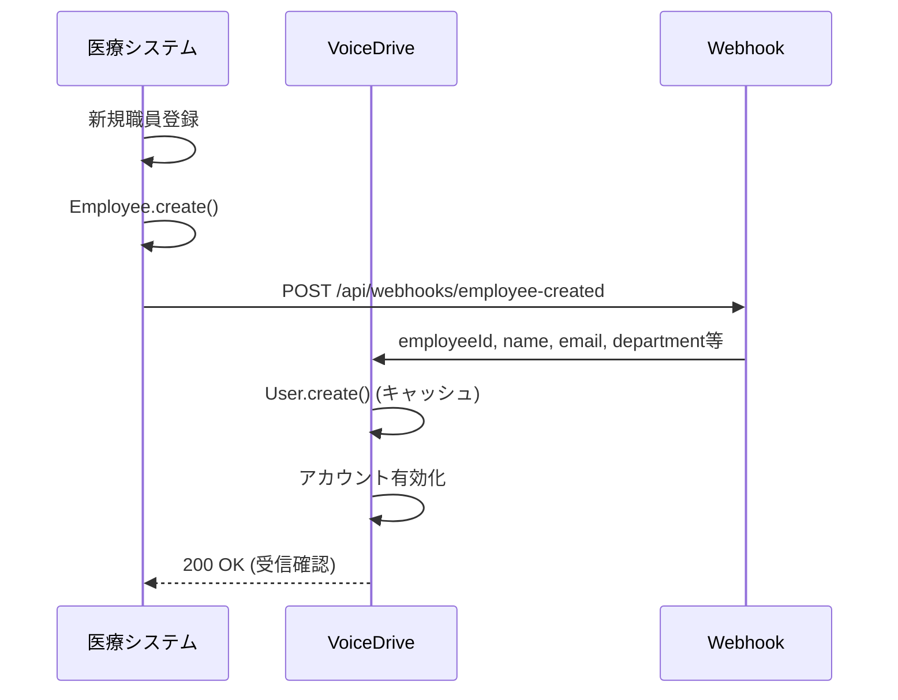
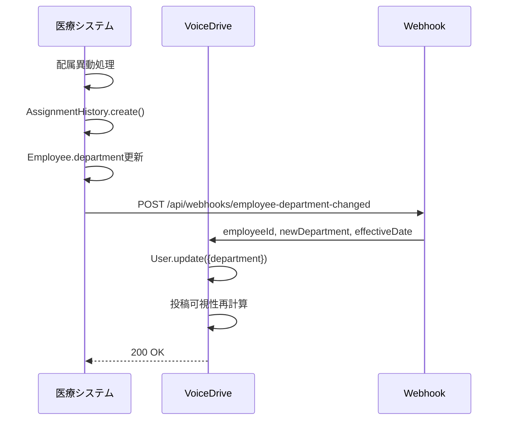
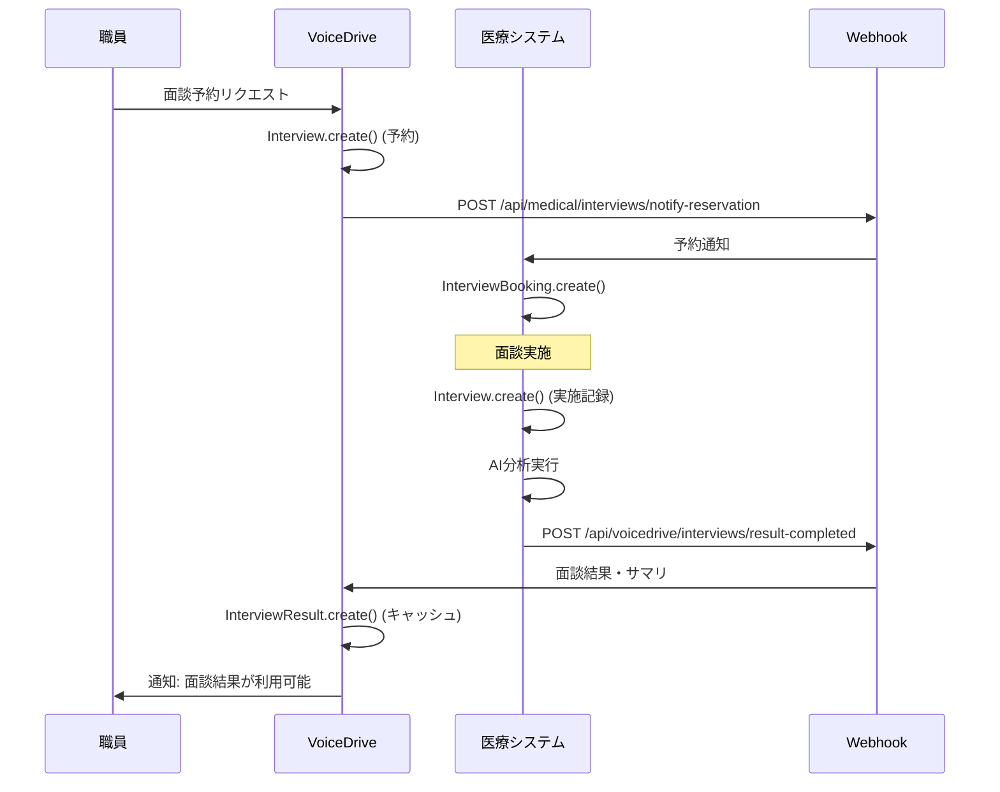
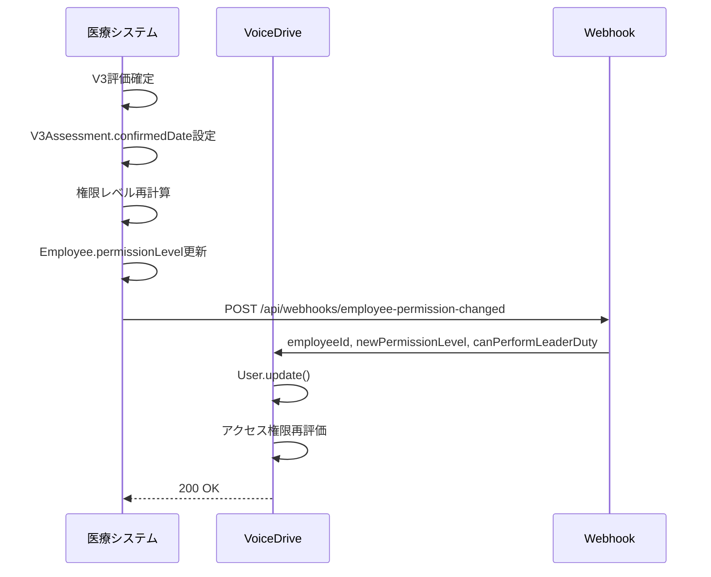
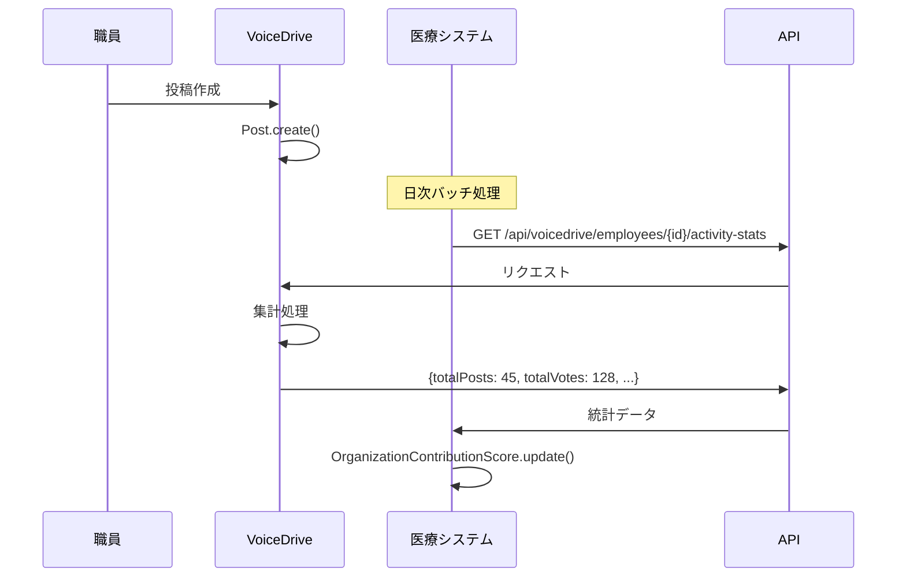

# データ管理責任分界点定義書

**文書番号**: DM-DEF-2025-1008-001
**作成日**: 2025年10月8日
**作成者**: VoiceDriveチーム
**目的**: VoiceDriveと医療職員管理システム間のデータ管理責任を明確化
**重要度**: 🔴 最重要

---

## 📋 エグゼクティブサマリー

### 背景
- VoiceDriveは組織の声を集めるシステム（投稿・フィードバック・面談・アンケート・プロジェクト提案）
- 医療職員管理システムは職員の全ライフサイクルを管理（採用→入社→評価→キャリア→退職）
- **DB構築計画書**によると医療システムは**146テーブル、29セクション**の大規模DBを構築予定
- MySQL統合環境（AWS Lightsail 16GB）に両システムが共存
- **データ重複と管理責任の明確化が必須**

### 基本原則
1. ✅ **Single Source of Truth（単一真実源）**: 各データは1つのシステムが責任を持つ
2. ✅ **API連携**: データ所有者がAPI経由で提供、他方はAPI利用のみ
3. ✅ **最小重複**: 必要最小限のキャッシュのみ許可（employeeIdやname等）
4. ✅ **リアルタイム同期**: Webhook経由で変更を即時通知
5. ✅ **明確な境界**: 「職員マスタ」は医療システム、「VoiceDrive活動」はVoiceDrive

---

## 🎯 医療チームからの質問への回答

### ❓ 1. VoiceDrive側で既に管理されている職員マスターデータは？

**VoiceDriveの`User`テーブルが保持するフィールド**:

| フィールド | 内容 | 管理責任 |
|----------|------|---------|
| `employeeId` | 職員ID（医療システムと同期） | 🔵 **医療システム** |
| `email` | メールアドレス | 🔵 **医療システム** |
| `name` | 氏名 | 🔵 **医療システム** |
| `department` | 部署名 | 🔵 **医療システム** |
| `facilityId` | 施設ID | 🔵 **医療システム** |
| `role` | 役割（キャッシュ用） | 🔵 **医療システム** |
| `position` | 役職 | 🔵 **医療システム** |
| `accountType` | アカウント種別 | 🔵 **医療システム** |
| `permissionLevel` | 権限レベル（1-25） | 🔵 **医療システム** |
| `canPerformLeaderDuty` | リーダー資格 | 🔵 **医療システム** |
| `professionCategory` | 職種カテゴリ | 🔵 **医療システム** |
| `parentId` | 上司ID | 🔵 **医療システム** |
| `avatar` | アバター画像URL | 🟢 **VoiceDrive** |
| `lastLoginAt` | 最終ログイン | 🟢 **VoiceDrive** |
| `loginCount` | ログイン回数 | 🟢 **VoiceDrive** |

**結論**:
- VoiceDriveの`User`テーブルは**キャッシュ専用**
- 職員マスタの真実の情報源は**医療システムのEmployeeテーブル**
- VoiceDriveは医療システムAPIから取得したデータをキャッシュするのみ

---

### ❓ 2. 医療システムがVoiceDriveに提供すべきデータは？

#### A. リアルタイム提供が必要なデータ（Webhook通知）

| データ | 提供方法 | 頻度 | 理由 |
|-------|---------|------|------|
| 職員入社 | Webhook + API | 即時 | VoiceDriveアカウント作成 |
| 職員情報変更 | Webhook + API | 即時 | 部署異動、昇進、権限変更を反映 |
| 職員退職 | Webhook + API | 即時 | アカウント無効化、投稿匿名化 |
| 権限レベル変更 | Webhook + API | 即時 | VoiceDrive機能アクセス制御 |
| 面談結果 | Webhook + API | 面談完了時 | VoiceDrive面談予約との連携 |

#### B. 定期バッチ提供（日次・週次）

| データ | 提供方法 | 頻度 | 理由 |
|-------|---------|------|------|
| V3評価結果 | API | 日次 | VoiceDriveでの権限レベル算出 |
| 経験年数 | API | 週次 | 投稿フィルタリング |
| 部署・施設マスタ | API | 日次 | VoiceDriveのフィルタ選択肢 |
| 職種・役職マスタ | API | 週次 | VoiceDriveの表示ラベル |

#### C. オンデマンド提供（必要時にAPI呼び出し）

| データ | 提供方法 | タイミング | 理由 |
|-------|---------|----------|------|
| 職員詳細情報 | API | ユーザープロフィール表示時 | 最新情報を表示 |
| 組織階層 | API | 承認フロー構築時 | 上司判定 |
| 権限詳細 | API | アクセス制御判定時 | 細かい権限チェック |

---

### ❓ 3. 現在のVoiceDrive運用における課題は？

#### 課題1: 職員データの部分的な不足

**問題**:
- VoiceDriveの`User`テーブルには`experienceYears`（経験年数）フィールドがない
- PersonalStationページで表示したいが、データがない
- 医療システムにも`experienceYears`が直接的にはない（`yearsOfService`はあるが経験年数とは異なる）

**解決策**:
```typescript
// 医療システムAPI提供例
GET /api/employees/{employeeId}/experience-summary
Response: {
  yearsOfService: 4.5,        // 勤続年数（当法人）
  totalExperienceYears: 8.2,  // 総職務経験年数（前職含む）
  currentPositionYears: 2.1,  // 現在の役職での年数
  specialtyExperienceYears: 6.5  // 専門分野経験年数
}
```

#### 課題2: 投票統計の集計先

**問題**:
- PersonalStationページで「投票した議題数」「反応数」を表示したい
- この統計データはVoiceDrive側で計算すべき？医療システム側で計算すべき？

**解決策**:
- **VoiceDriveが責任を持つ**: 投稿・投票・フィードバックはVoiceDrive管轄
- 統計APIをVoiceDriveが提供し、医療システムが利用する形
```typescript
// VoiceDrive API提供例
GET /api/voicedrive/employees/{employeeId}/activity-stats
Response: {
  totalPosts: 45,
  totalVotes: 128,
  totalFeedbackReceived: 67,
  totalFeedbackSent: 52,
  projectsProposed: 3,
  surveysCompleted: 12
}
```

#### 課題3: 面談データの二重管理

**問題**:
- VoiceDriveに`Interview`テーブルあり（面談予約）
- 医療システムに`Interview`テーブルあり（面談実施記録）
- **どちらが正？**

**解決策**:
- **VoiceDrive**: 面談予約・スケジューリング
- **医療システム**: 面談実施記録・詳細内容・AI分析結果
```
VoiceDrive.Interview (予約情報)
  ↓ 面談実施
MedicalSystem.Interview (実施記録) ← 真実の情報源
  ↓ Webhook通知
VoiceDrive.InterviewResult (結果キャッシュ)
```

---

### ❓ 4. 技術的な制約は？

#### API仕様

**認証方式**:
- JWT Bearer Token認証
- APIキー認証（バッチ処理用）
- IPホワイトリスト（管理画面アクセス）

**レート制限**:
- 通常API: 100リクエスト/分/ユーザー
- バッチAPI: 1000リクエスト/時間
- Webhook: 20リクエスト/秒

**データ形式**:
- JSON（UTF-8）
- 日時: ISO 8601形式
- 文字エンコーディング: UTF-8

#### 同期方式

**リアルタイム同期（Webhook）**:
```typescript
// 医療システム → VoiceDrive
POST https://voicedrive.ai/api/webhooks/employee-updated
Headers:
  X-Medical-System-Signature: HMAC-SHA256署名
  Content-Type: application/json
Body: {
  eventType: "employee.department_changed",
  employeeId: "OH-NS-2024-001",
  timestamp: "2025-10-08T15:30:00Z",
  data: {
    department: "内科",
    previousDepartment: "外科",
    effectiveDate: "2025-10-01"
  }
}
```

**バッチ同期（定期API）**:
```typescript
// VoiceDrive → 医療システム（日次）
GET /api/employees?updatedSince=2025-10-07T00:00:00Z
Response: {
  employees: [...],
  nextPageToken: "abc123",
  totalCount: 245
}
```

---

## 📊 データ管理責任マトリクス

### カテゴリ1: 職員基本情報

| データ項目 | VoiceDrive | 医療システム | 提供方法 | 備考 |
|-----------|-----------|-------------|---------|------|
| 職員ID（employeeId） | キャッシュ | ✅ マスタ | API | 入社時発行 |
| 氏名（name, nameKana） | キャッシュ | ✅ マスタ | API | 変更時Webhook |
| メールアドレス | キャッシュ | ✅ マスタ | API | 変更時Webhook |
| 電話番号 | ❌ | ✅ マスタ | API | 個人情報、VoiceDrive不要 |
| 生年月日 | ❌ | ✅ マスタ | API | 個人情報、VoiceDrive不要 |
| 住所 | ❌ | ✅ マスタ | API | 個人情報、VoiceDrive不要 |
| 緊急連絡先 | ❌ | ✅ マスタ | API | 個人情報、VoiceDrive不要 |

**方針**:
- 個人情報はVoiceDriveで持たない
- 氏名・メールはキャッシュのみ（表示用）

---

### カテゴリ2: 組織情報

| データ項目 | VoiceDrive | 医療システム | 提供方法 | 備考 |
|-----------|-----------|-------------|---------|------|
| 施設ID（facilityId） | キャッシュ | ✅ マスタ | API | 施設マスタ参照 |
| 部署（department） | キャッシュ | ✅ マスタ | API | 部署マスタ参照 |
| 役職（position） | キャッシュ | ✅ マスタ | API | 役職マスタ参照 |
| 上司ID（parentId） | キャッシュ | ✅ マスタ | API | 組織階層 |
| 権限レベル（permissionLevel） | キャッシュ | ✅ マスタ | API | 1-25レベル |
| リーダー資格（canPerformLeaderDuty） | キャッシュ | ✅ マスタ | API | V3評価から算出 |
| 職種カテゴリ（professionCategory） | キャッシュ | ✅ マスタ | API | 職種マスタ参照 |
| 配属履歴 | ❌ | ✅ マスタ | API | AssignmentHistory |
| 組織階層 | キャッシュ | ✅ マスタ | API | 承認フロー用 |
| **🆕 投票グループ（VotingGroup）** | **✅ マスタ** | ❌ | VoiceDrive管理 | 小規模部門統合用 |
| **🆕 投票グループ代表承認者** | **✅ マスタ** | ❌ | VoiceDrive管理 | プロジェクト承認者指定 |
| **🆕 承認者ローテーション設定** | **✅ マスタ** | ❌ | VoiceDrive管理 | 月次/四半期/PJベース |

**方針**:
- 組織構造は医療システムが管理
- VoiceDriveは表示・フィルタリング用にキャッシュ
- **🆕 投票グループはVoiceDrive独自管理**（2025-10-12追加）
  - 小規模部門（診療支援5名+薬剤3名+事務8名）を統合投票単位にする機能
  - 代表承認者の指定・ローテーション機能はVoiceDrive内部ロジック
  - 医療システムには影響なし（組織マスターは変更なし）

---

### カテゴリ3: 雇用情報

| データ項目 | VoiceDrive | 医療システム | 提供方法 | 備考 |
|-----------|-----------|-------------|---------|------|
| 入社日（hireDate） | ❌ | ✅ マスタ | API | Employee.hireDate |
| 退職日（retirementDate） | キャッシュ | ✅ マスタ | Webhook | 即時通知必須 |
| 雇用形態（employmentType） | ❌ | ✅ マスタ | API | 正社員、契約等 |
| 勤続年数（yearsOfService） | ❌ | ✅ マスタ | API | 計算値 |
| 経験年数（experienceYears） | ❌ | ✅ マスタ | API | WorkExperience集計 |
| 試用期間情報 | ❌ | ✅ マスタ | API | OnboardingProgress |
| 契約情報 | ❌ | ✅ マスタ | API | EmploymentContract |

**方針**:
- 雇用関連は100%医療システム管轄
- VoiceDriveは投稿フィルタリング用に一部取得

---

### カテゴリ4: 評価・スキル

| データ項目 | VoiceDrive | 医療システム | 提供方法 | 備考 |
|-----------|-----------|-------------|---------|------|
| V3評価 | ❌ | ✅ マスタ | API | V3Assessment（146テーブル中） |
| V1/V2評価 | ❌ | ✅ マスタ | API | 旧評価制度 |
| クリニカルラダー | ❌ | ✅ マスタ | API | ClinicalLadderAssessment |
| スキル評価 | ❌ | ✅ マスタ | API | EmployeeSkill, SkillRadarAssessment |
| 能力評価 | ❌ | ✅ マスタ | API | CompetencyAssessment |
| 目標管理（MBO） | ❌ | ✅ マスタ | API | Goal |
| 研修履歴 | ❌ | ✅ マスタ | API | TrainingHistory |
| 資格情報 | ❌ | ✅ マスタ | API | Certification |

**方針**:
- 評価・スキルは100%医療システム管轄
- VoiceDriveは表示のみ（APIで取得）

---

### カテゴリ5: 面談

| データ項目 | VoiceDrive | 医療システム | 提供方法 | 備考 |
|-----------|-----------|-------------|---------|------|
| 面談予約 | ✅ マスタ | キャッシュ | Webhook | VoiceDrive.Interview |
| 面談実施記録 | キャッシュ | ✅ マスタ | API | MedicalSystem.Interview |
| 面談AI分析 | キャッシュ | ✅ マスタ | Webhook | AI分析は医療システム |
| 面談タイプ定義 | ❌ | ✅ マスタ | API | InterviewTypeMaster（10種類） |
| NotebookLMリンク | ❌ | ✅ マスタ | API | Interview.notebookLmUrl |
| サマリ・フィードバック | キャッシュ | ✅ マスタ | Webhook | Interview.feedbackSummary |

**方針**:
- **VoiceDrive**: 予約・スケジューリング
- **医療システム**: 実施記録・詳細内容
- Webhook双方向連携

---

### カテゴリ6: VoiceDrive活動データ

| データ項目 | VoiceDrive | 医療システム | 提供方法 | 備考 |
|-----------|-----------|-------------|---------|------|
| 投稿（Post） | ✅ マスタ | ❌ | - | VoiceDrive管轄 |
| フィードバック（Feedback） | ✅ マスタ | ❌ | API提供 | VoiceDrive→医療 |
| プロジェクト提案（Project） | ✅ マスタ | ❌ | API提供 | VoiceDrive→医療 |
| アンケート（Survey） | ✅ マスタ | ❌ | API提供 | VoiceDrive→医療 |
| 投稿通報（PostReport） | ✅ マスタ | ❌ | - | VoiceDrive管轄 |
| データ同意（DataConsent） | ✅ マスタ | ❌ | - | VoiceDrive管轄 |
| ログイン履歴 | ✅ マスタ | ❌ | API提供 | VoiceDrive→医療 |

**方針**:
- VoiceDrive活動は100%VoiceDrive管轄
- 医療システムは統計情報のみ取得（API経由）

---

### カテゴリ7: 健康・勤怠

| データ項目 | VoiceDrive | 医療システム | 提供方法 | 備考 |
|-----------|-----------|-------------|---------|------|
| 健康診断結果 | ❌ | ✅ マスタ | ❌ 提供不要 | 個人情報・医療情報 |
| ストレスチェック | ❌ | ✅ マスタ | ❌ 提供不要 | 個人情報 |
| メンタルヘルス相談 | ❌ | ✅ マスタ | ❌ 提供不要 | 機密情報 |
| 勤怠記録 | ❌ | ✅ マスタ | ❌ 提供不要 | VoiceDrive不要 |
| 休暇残高 | ❌ | ✅ マスタ | ❌ 提供不要 | VoiceDrive不要 |
| ワークライフバランススコア | ❌ | ✅ マスタ | API（集計値のみ） | 匿名化統計 |

**方針**:
- 健康・勤怠は100%医療システム管轄
- VoiceDriveには**提供しない**（個人情報保護）
- 匿名化された統計値のみAPI提供

---

### カテゴリ8: 給与・人事情報

| データ項目 | VoiceDrive | 医療システム | 提供方法 | 備考 |
|-----------|-----------|-------------|---------|------|
| 給与情報 | ❌ | ✅ マスタ | ❌ 提供不要 | 機密情報 |
| 賞与情報 | ❌ | ✅ マスタ | ❌ 提供不要 | 機密情報 |
| 昇給履歴 | ❌ | ✅ マスタ | ❌ 提供不要 | 機密情報 |
| 懲戒記録 | ❌ | ✅ マスタ | ❌ 提供不要 | 機密情報 |
| 表彰履歴 | ❌ | ✅ マスタ | API（公開分のみ） | Award.isPublic=true |
| 家族情報 | ❌ | ✅ マスタ | ❌ 提供不要 | 個人情報 |
| 退職理由 | ❌ | ✅ マスタ | ❌ 提供不要 | 機密情報 |

**方針**:
- 給与・人事機密情報は100%医療システム管轄
- VoiceDriveには**一切提供しない**

---

### カテゴリ9: マスタデータ

| データ項目 | VoiceDrive | 医療システム | 提供方法 | 備考 |
|-----------|-----------|-------------|---------|------|
| 施設マスタ | キャッシュ | ✅ マスタ | API | FacilityMaster |
| 部署マスタ | キャッシュ | ✅ マスタ | API | DepartmentMaster |
| 職種マスタ | キャッシュ | ✅ マスタ | API | OccupationMaster |
| 役職マスタ | キャッシュ | ✅ マスタ | API | PositionMaster |
| 雇用形態マスタ | キャッシュ | ✅ マスタ | API | EmploymentTypeMaster |
| 面談タイプマスタ | ❌ | ✅ マスタ | API | InterviewTypeMaster |
| スキルマスタ | ❌ | ✅ マスタ | API | SkillMaster |

**方針**:
- 全マスタデータは医療システムが管理
- VoiceDriveはAPI経由でキャッシュ

---

### カテゴリ10: AI・分析

| データ項目 | VoiceDrive | 医療システム | 提供方法 | 備考 |
|-----------|-----------|-------------|---------|------|
| AI機能設定 | ❌ | ✅ マスタ | API | AIFeatureConfiguration |
| LLMモデル管理 | ❌ | ✅ マスタ | API | LLMModel（共有） |
| プロンプトテンプレート | 部分的 | ✅ マスタ | API | PromptTemplate |
| AI利用ログ | 各自管理 | 各自管理 | API相互 | 統合分析 |
| 成長予測 | ❌ | ✅ マスタ | API | GrowthPrediction |
| タレントポートフォリオ | ❌ | ✅ マスタ | API | TalentPortfolioAnalysis |

**方針**:
- AI制御は医療システムが主導
- VoiceDriveは一部機能のみローカル管理

---

## 🔄 統合フロー図

### フロー1: 職員入社時



---

### フロー2: 部署異動時



---

### フロー3: 面談フロー



---

### フロー4: V3評価→権限レベル更新



---

### フロー5: VoiceDrive活動→医療システム統計



---

## 📝 推奨API仕様

### API 1: 職員情報取得

**エンドポイント**: `GET /api/employees/{employeeId}`

**リクエスト**:
```http
GET /api/employees/OH-NS-2024-001
Authorization: Bearer {jwt_token}
```

**レスポンス**:
```json
{
  "employeeId": "OH-NS-2024-001",
  "name": "山田 花子",
  "nameKana": "ヤマダ ハナコ",
  "email": "hanako.yamada@obara-hospital.jp",
  "department": "内科",
  "facility": "小原病院",
  "position": "看護師",
  "permissionLevel": 6.0,
  "canPerformLeaderDuty": false,
  "professionCategory": "nurse",
  "parentId": "OH-NS-2020-015",
  "hireDate": "2024-04-01",
  "yearsOfService": 0.5,
  "totalExperienceYears": 3.2,
  "isActive": true
}
```

---

### API 2: 職員リスト取得（ページング）

**エンドポイント**: `GET /api/employees`

**リクエスト**:
```http
GET /api/employees?facility=obara-hospital&department=内科&page=1&limit=50
Authorization: Bearer {jwt_token}
```

**レスポンス**:
```json
{
  "employees": [...],
  "pagination": {
    "page": 1,
    "limit": 50,
    "totalCount": 245,
    "totalPages": 5,
    "hasNext": true
  },
  "filters": {
    "facility": "obara-hospital",
    "department": "内科"
  }
}
```

---

### API 3: 面談結果通知（Webhook）

**エンドポイント**: `POST /api/webhooks/interview-completed`

**リクエスト**:
```http
POST /api/webhooks/interview-completed
Content-Type: application/json
X-Medical-System-Signature: sha256=abc123...
```

```json
{
  "eventType": "interview.completed",
  "timestamp": "2025-10-08T15:30:00Z",
  "data": {
    "interviewId": "INT-2024-OH-001",
    "employeeId": "OH-NS-2024-001",
    "interviewDate": "2025-10-08",
    "interviewType": "regular",
    "completedAt": "2025-10-08T15:30:00Z",
    "summary": "前向きな姿勢が見られる。成長意欲が高い。",
    "keyPoints": [
      "業務に対する積極的な姿勢",
      "チームワークの向上"
    ],
    "feedbackToEmployee": "今後も前向きに取り組んでください。",
    "followUpRequired": false
  }
}
```

---

### API 4: VoiceDrive活動統計取得

**エンドポイント**: `GET /api/voicedrive/employees/{employeeId}/activity-stats`

**リクエスト**:
```http
GET /api/voicedrive/employees/OH-NS-2024-001/activity-stats
Authorization: Bearer {jwt_token}
```

**レスポンス**:
```json
{
  "employeeId": "OH-NS-2024-001",
  "period": "2024-01-01 to 2024-10-08",
  "stats": {
    "totalPosts": 45,
    "totalVotes": 128,
    "totalFeedbackReceived": 67,
    "totalFeedbackSent": 52,
    "projectsProposed": 3,
    "surveysCompleted": 12,
    "loginDays": 180,
    "averageEngagement": 85.5
  }
}
```

---

## 🔒 セキュリティ・プライバシー

### データ提供制限

| データ分類 | VoiceDriveへの提供 | 理由 |
|-----------|------------------|------|
| 基本情報（氏名、メール） | ✅ 許可 | 表示用に必要 |
| 組織情報（部署、役職） | ✅ 許可 | フィルタリング用 |
| 個人情報（住所、電話、生年月日） | ❌ 禁止 | VoiceDriveで不要 |
| 健康情報（健診、ストレスチェック） | ❌ 禁止 | 医療機密情報 |
| 給与情報 | ❌ 禁止 | 人事機密情報 |
| 懲戒記録 | ❌ 禁止 | 人事機密情報 |
| 評価結果（V3等） | ⚠️ 集計値のみ | 権限レベル算出用 |
| 表彰履歴 | ✅ 公開分のみ | Award.isPublic=true |

---

### API認証・認可

**認証方式**:
1. JWT Bearer Token（通常API）
2. APIキー + HMAC-SHA256署名（Webhook）
3. IPホワイトリスト（管理画面）

**権限チェック**:
```typescript
// 医療システムAPI例
if (requestingSystem === 'VoiceDrive') {
  // VoiceDriveに許可されたフィールドのみ返す
  return {
    employeeId: employee.employeeId,
    name: employee.name,
    email: employee.email,
    department: employee.department,
    // 給与情報は含めない
  };
}
```

---

## 📅 実装ロードマップ

### Phase 1: 基本統合（2週間）

**Week 1**:
- [x] データ管理責任定義書作成 ← **今ここ**
- [ ] API仕様書作成（OpenAPI 3.0）
- [ ] Webhook署名検証実装
- [ ] 医療システム職員情報取得API実装
- [ ] VoiceDrive User同期機能実装

**Week 2**:
- [ ] 入社・退職Webhook実装
- [ ] 部署異動Webhook実装
- [ ] 権限レベル更新Webhook実装
- [ ] 統合テスト（手動）
- [ ] ドキュメント整備

---

### Phase 2: 面談統合（1週間）

**Week 3**:
- [ ] 面談予約通知Webhook実装（VD→MS）
- [ ] 面談結果通知Webhook実装（MS→VD）
- [ ] InterviewResultキャッシュ機能実装
- [ ] 統合テスト

---

### Phase 3: 定期バッチ同期（1週間）

**Week 4**:
- [ ] 職員情報日次同期バッチ
- [ ] マスタデータ日次同期バッチ
- [ ] VoiceDrive活動統計API実装
- [ ] エラーハンドリング・リトライ機能
- [ ] 監視・アラート設定

---

### Phase 4: 高度な統合（2週間）

**Week 5-6**:
- [ ] V3評価連携
- [ ] AI機能統合
- [ ] ダッシュボード統合
- [ ] パフォーマンスチューニング
- [ ] 本番環境デプロイ

---

## ✅ チェックリスト

### 医療システム側の実装

- [ ] 職員情報取得API実装
- [ ] 職員リストAPI実装（ページング）
- [ ] マスタデータ取得API実装
- [ ] 入社Webhook送信機能
- [ ] 退職Webhook送信機能
- [ ] 部署異動Webhook送信機能
- [ ] 権限レベル更新Webhook送信機能
- [ ] 面談結果Webhook送信機能
- [ ] Webhook署名検証ライブラリ
- [ ] API認証・認可機能
- [ ] レート制限機能
- [ ] エラーログ記録
- [ ] リトライ機能
- [ ] 統合テスト

---

### VoiceDrive側の実装

- [ ] User同期機能
- [ ] Webhook受信エンドポイント
- [ ] 署名検証機能
- [ ] 医療システムAPI呼び出し機能
- [ ] キャッシュ更新ロジック
- [ ] エラーハンドリング
- [ ] リトライ機能
- [ ] VoiceDrive活動統計API実装
- [ ] InterviewResultキャッシュ機能
- [ ] 統合テスト
- [ ] ドキュメント更新

---

## 🎯 成功指標（KPI）

### 統合品質

| 指標 | 目標値 | 測定方法 |
|------|--------|---------|
| データ同期精度 | 99.9% | 差分チェック |
| Webhook成功率 | 99.5% | ログ分析 |
| API応答時間 | <500ms | パフォーマンス監視 |
| データ整合性 | 100% | 日次検証バッチ |
| エラー率 | <0.1% | エラーログ分析 |

### 運用効率

| 指標 | 目標値 | 測定方法 |
|------|--------|---------|
| 手動同期作業削減 | 100% | 作業時間計測 |
| データ不整合報告 | 0件/月 | ユーザーレポート |
| システム可用性 | 99.9% | アップタイム監視 |
| データ遅延 | <5分 | タイムスタンプ分析 |

---

## 📞 連絡先

### VoiceDriveチーム
- Slack: #voicedrive-integration
- メール: voicedrive-dev@example.com
- 担当: システム開発チーム

### 医療システムチーム
- Slack: #medical-system-integration
- メール: medical-system-dev@example.com
- 担当: システム開発チーム

### 共通
- MCPサーバー共有フォルダ: `mcp-shared/docs/`
- 統合テストスケジュール: 毎週金曜 15:00-17:00
- 定例会議: 毎週月曜 10:00-11:00

---

**文書終了**

最終更新: 2025年10月8日
バージョン: 1.0
承認: 未承認（レビュー待ち）
